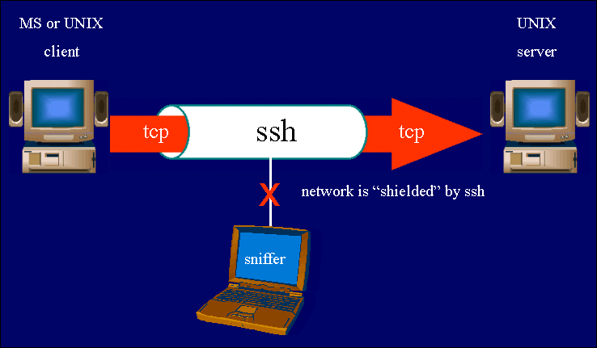

## File Transfer and Terminal Software Instructions

### Secure FTP or SCP

The secure versions of FTP (also called SCP for Secure Copy) are recommended for you to install. The graphical software is available 
from <a href="http://winscp.net/eng/index.php">WinSCP</a>
for Windows and <a href="http://cyberduck.ch">Cyberduck</a> works on both Windows and Mac. These are like FTP but encrypt the information that goes over the Internet and so is secure.  You should use one of these. You use the host<em> gl.umbc.edu</em>
for any secure FTP software.

### Terminal Programs (telnet and ssh)

A terminal program is a program that allows you to open a window where you have a command line interface to a remote computer.  The older terminal program is called 'telnet' and is not secure. It does not work on gl (or anywhere else nowadays).
The secure version of telnet is 'ssh' and that is the one you will use.  
There is a windows command line client available from 
<a href="http://www.ayera.com/teraterm/">Terra Term SSH</a>. 
The simple <em>putty.exe</em> MSWindows ssh client is available at 
<a href="http://www.chiark.greenend.org.uk/%7esgtatham/putty/download.html">
	http://www.chiark.greenend.org.uk/~sgtatham/putty/download.html</a>
- you do not have to install it but rather just download the executable file and run it. 
  Unix machines like Apple Mac have command line ssh already installed.
  ​      
You will need to know some unix commands and so do these <a href="unix.html.md" target="_blank">unix commands tutorial exercises</a>.  Once you have an ssh client up and running and connected to <em>gl.umbc.edu</em>, you can type the unix commands there. The '%' prompt shown in the tutorial will look different on gl, but that is where you type the commands. Since the vast majority of web servers are on linux or unix machines, it is necessary for us to know a handful of unix commands so as not to appear to be clowns.

Here are some resources to help you use the terminal programs:

- A <a href="http://www.fastcomet.com/tutorials/getting-started/putty">tutorial</a> for putty on windows (you will use the host <em>gl.umbc.edu </em>with your umbc username and password)
- A <a href="https://www.tutorialspoint.com/unix/unix-useful-commands.htm">reference</a> for command line access from a unix, linux, or mac.

### Storage space on gl

<li>Storage is limited on gl - about 25mb.</li>
<li>Always make sure you have enough space in your account. Use the <em>fs quota</em> command at the gl prompt.  In the example below, the quota is almost gone and so one must delete some files to make more room in their account.  One can also transfer files to their <a href="https://wiki.umbc.edu/display/faq/Box">umbc box account</a> rather than deleting them to make room.  The web interface is at https://umbc.app.box.com (one can also setup a webdav share - see the faq above).  Your umbc box account has unlimited space.
<pre>
$>fs quota
99% of quota used.
</pre>
</li>

### Navigation in your Student Account

The gl host (gl.umbc.edu) is where you have your account. See the syllabus for links to the documentation for student accounts. Your account has the following directory structure where the parentheses denote hierarchical levels:

`(username (Mail, backup, home, pub (swe20XX)))`

<b>Important</b> - the web directory changes each year.  So use the correct year, for example <em>swe2017</em> in the year 2017. The examples all show <em>swe20XX</em> just so I don't have to change it yearly in this documentation. One can just change the directory name each year (using mv or cp) so nothing is lost.

For example, my username is canfield and that is the root of my account structure. The two important directories for the exercises in this book will be home and swe20XX. Your home directory is where your private files are kept. The swe2016 directory is under the pub directory and is the root of your web directory. Any file you put in swe2016 is available on the Internet. You or anyone else can access that file with the following format of a URL:

`http://swe.umbc.edu/~canfield/test/file.html`

Where you can make any subdirectories under swe20XX you wish such as the directory 'test'.  Here is a working example in my account: http://swe.umbc.edu/~pcomitz/programs/meta.html.

Check that you have your web directory (swe2016) activated. Go to http://swe.umbc.edu/~username (with your username) and if you see a web page or a web directory browse, you are ok. If not, you need to activate your web directory by running this script from the gl command prompt:

`/afs/umbc.edu/common/bin/enable_student_web_space.sh`

Note that even though you SCP your files to gl.umbc.edu, you must use the swe.umbc.edu in the URL for access. Also note the special tilda symbol ~ that must precede your username. Finally, you can put the filename that you wish to see. You can include a path of any depth as long as it is below the swe20XX directory. In the example, the file.html file is in the test directory which must be under swe2016. The directory name swe20XX will never appear in a URL since it is the root. The complete physical pathname to a home directory on gl is:

`/afs/umbc.edu/users/c/a/canfield/home`

When you SSH into your gl account, you are put in the home directory. So if you wanted to edit a file in swe2016, an easy way to navigate there would be:

`$>cd ../pub/swe20XX`

There is usually a [symbolic link](https://en.wikipedia.org/wiki/Symbolic_link) to swe20XX in your home directory, however, so one can more simply do (but it is important to know what is happening):

`$>cd swe2016`

One can see the symbolic link with the 'ls' command from your home directory:

		$>ls -l
		total 5
		drwxr-xr-x 2 testkip1 rpc 2048 Aug 13  1998 bin
		lrwxr-xr-x 1 testkip1 rpc   14 Aug  5 08:03 swe2016 -> ../pub/swe2016
		lrwxr-xr-x 1 testkip1 rpc   10 May 17  2011 www -> ../pub/www

Or using the [tree](http://mama.indstate.edu/users/ice/tree/) command (not installed by default on gl) from the one level up user directory:

		$>~/bin/tree -d -L 2 --charset ASCII
		.
		|-- backup
		|   |-- home
		|   `-- pub
		|-- home
		|   |-- bin
		|   |-- swe2016 -> ../pub/swe2016
		|   `-- www -> ../pub/www
		`-- pub
		    |-- swe2016
		    `-- www

A `web directory` is a directory that has been configured by the web server admin to serve out web pages.  For students that have previously used the 'www' directory on gl for a web directory, OIT has changed this in fall of 2016 to use 'swe2016' instead on a virtual machine. This will allow many improvements including security enhancement and upgrade to php5.  The web directory name will change each year to reflect the current year.

