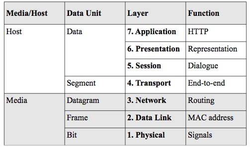
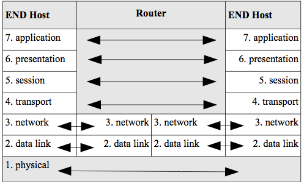
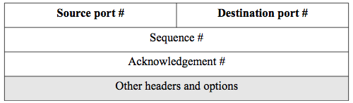
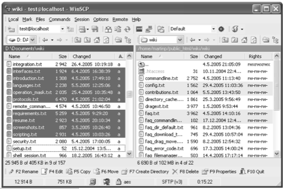
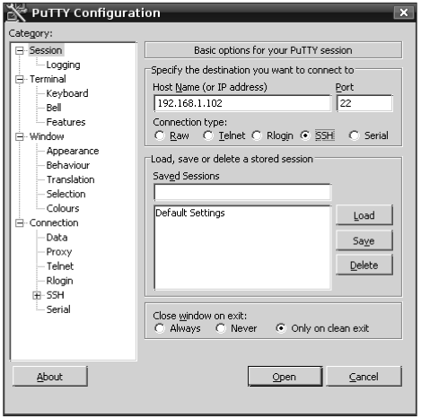
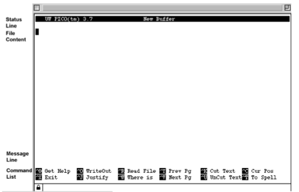

##Chapter1 - Introduction

This text covers distributed systems for students in Information Systems programs. It has two major sections for architecture and implementation and a third section for advanced topics. Architecture refers to a broad view of the area to include the basic concepts and technology of distributed systems. We will look at the history of distributed systems in computing and concentrate on service-oriented architectures (SOA). As a side-effect of this treatment, we will also learn basic XML and markup language technology. The book includes many practical exercises and projects in XML. Chapter 2 covers the history of distributed systems, Chapter 3 reviews Internet and web technology. Chapter 4 covers SOAP and using XML Web Services for SOA while chapters 5 and 6 extend this treatment to the web services description language (WSDL) and other web services standards. Finally, chapter 7 covers representational state transfer (REST) web services.

Implementation issues include fundamental technologies for implementation of distributed systems and programming concepts. Chapter 8 covers implementation details for distributed systems such as: distributed naming systems, storage technology, replication, caching, and fault tolerance concepts. Chapters 9-11 use programming exercises to make the concepts learned in the first section more concrete. Chapters 12-13 cover the advanced topics: the semantic web and cloud computing. Most of the outline code used in the exercises is given to you. The needed programming language details and references are given in the text and you are primarily responsible for understanding the programs given to you. There are weekly exercises.

Information Systems programs have developed separately from similar programs in Computer Science and Business (usually under the name Management of Information Systems - MIS) with a more technical approach than MIS and a more applied approach than CS. The three basic technology building blocks for study in Information Systems are:

-   Programming with Systems Analysis and Design
-   Networking
-   Databases

All other areas of study build on these foundations. This book assumes a basic semester long course in each of these areas. This book builds upon this for a more complex treatment of distributed systems. In a real sense, the study of distributed systems is the core technical area of Information Systems since all such systems are distributed. A short review of some relevant topics from those previous courses follows.

###Programming

This course assumes a basic object-oriented programming course, but does not assume that it was in any specific language. We will learn the relevant details of any programming language that we use in the second half of this book, and the focus will be on reading code and making minor modifications to it rather than a full treatment of any language.
Being able to read and understand the logic and approach of the simple programs will add considerably to your maturity and understanding of distributed systems.

###Networking

Recall the OSI seven layer model given in figure 1.1. We will be primarily concerned with the Host layers from the left-hand column in figure 1.1. This is because we will be discussing services and hosts rather than the networking details of how a packet gets from one host to another. But of course, it is important to understand that as a pre-
requisite. Let's start at the bottom at layer 2.

Figure 1.1. The OSI seven layer model

The data link layer is typically represented as having two sub-layers:
the media access control layer (MAC) and the logical link control layer (LLC). The MAC is responsible for getting the digital signal off the wire and representing it as a string of bits. The LLC multiplexes multiple protocols that might need to be passed upward in the stack. The important concept for our purposes is that the data link layer provides physical addressing which is required for any packet to be delivered to a network interface card (NIC). The physical address is sometimes called the MAC address or a hardware address. The Ethernet protocol that you studied in your basic networking course is an example of a data link protocol. Note that the second column in figure 1.1 shows what a packet protocol data unit (PDU) is called at that layer. For example, at the data link layer, it is a frame which is the entire packet as a string of bits.

The network layer provides logical addresses such as an IP address which is the 32-bit address system provided by the internet (IP4) protocol. It also provides routing protocols that use dynamically created tables to optimally forward packets on a network of routers such as the Internet.
A hierarchical, two layer addressing scheme is needed (physical and logical) because the physical address is required to deliver a packet to a NIC and each hop of a route is a destination for the packet. The logical address is for the final host destination.

The transport layer is an end-to-end protocol in that it is a protocol that is between two hosts. It requires a port number that identifies a process on a host. Remember that all hosts are multi-processing machines that host many processes. Therefore, a port number and a logical address are required to identify a particular process on a host. For example, a web server runs by convention on port 80 and so a packet intended for a web server would have port 80 in the header at the transport layer and the host logical address in the header at the network layer. The transport layer protocol is also responsible for flow control,
sequencing, and reliability of delivery.

The protocols at each layer must work together and so come from the same standard family called a stack. For example, the TCP/IP stack is a family of protocols at each layer that is used by the Internet. The name comes from a concatenation of the two individual protocols of the transport and network layers to stand for the entire stack where transmission control protocol (TCP) is the connection-oriented transport layer protocol.

The session layer establishes, manages and terminates the connections between the local and remote application. It will be important later in the book for remote procedure call (RPC).

The presentation layer is concerned with data representation and transform between the representations that different hosts need. When data is encrypted for secure communications, the presentation layer is responsible for encryption and decryption.

The application layer is the network protocol that interacts with the actual user application. For example, the hypertext transfer protocol (HTTP) interacts with the web browser which is a user application. We will cover HTTP in detail in chapter 3.

The protocols at each layer communicate with each other by peer-to-peer communications through the PDU headers. Figure 1.2 shows this process.

Figure 1.2. Peer-to-peer network communications.

You can see in figure 1.2 that each protocol layer communicates with its peer layer using the header. Furthermore, you can see that a router only operates at the network layer since its function is to accept packets and then forward them to another router or the final destination host if attached.

Figure 1.3. The TCP header.

Figure 1.3 shows an example of a simplified header structure for TCP.
The header is, of course, a linear string of bits and the table structure in figure 1.3 presents that with each row being 32-bits. The destination port number, for example is 16-bits. So the sender creates this packet and puts port 80 in the TCP header. That way, the receiving host can look in the TCP packet and find that communication from its peer layer.

###Databases

Databases are essential for distributed systems to maintain state for distributed applications. Relational databases (RDB) are most commonly used and were the subject of your introductory database course. We will be primarily concerned with RDB in this book. After a period of almost exclusive use of RDB in distributed systems, there has been a recent move to use different types of databases such as native XML databases and the so-called 'not only SQL' (noSQL) databases for web applications in addition to RDB.

###Distributed Systems

Distributed systems use these building blocks of networks, databases,
and applications to create a whole that is greater than its parts. This usefulness comes at a cost of some complexity and that is what we will study in this course. We will look at the following concepts in general and for specific technological solutions:

-   Architecture - how distributed systems are put together to provide a single system abstraction from many separate parts.
-   Fault-tolerance - how distributed systems can continue to provide service when some parts have failed to provide availability until they are recovered.
-   Consistency - how distributed systems can maintain logical coherency when data is distributed.
-   Scalability - how a distributed system can grow to meet demand in an efficient and effective way.
-   Performance - how to optimize response time when components are distributed.
-   Security - how to ensure data integrity and confidentiality is a distributed environment.

Peter Deutsch defines 8 fallacies of distributed computing:

1.  The network is reliable.
2.  Latency is zero.
3.  Bandwidth is infinite.
4.  The network is secure.
5.  Topology doesn't change.
6.  There is one administrator.
7.  Transport cost is zero.
8.  The network is homogeneous.

These 8 fallacies are why the concepts of architecture, fault-tolerance,
consistency, scalability, performance, and security are complex to deliver. This book will address these issues. We can define a distributed system as a group of networked computers that appears a single system.

The final section of this chapter covers the computing environment that will be presupposed by exercises later in the book. This will require elementary command-line knowledge of unix-like operating systems using secure terminal emulation and secure file transfer.

###The UNIX command-line

The environment described here matches that for the Linux student accounts on the gl host at the University of Maryland, UMBC, but is basically the same for any account with a unix-like operating system.

You need to learn the following this week:

-   Use of an SCP client
-   Use of an SSH client
-   Use of a small number of unix commands
-   Navigation of your student account on gl
-   The SCP client

The basic non-secure, application layer protocol for the TCP/IP stack is the file transfer protocol (FTP). It sets up two connections where one is used for the FTP commands and one is used for the actual file transfer. It allows you to transfer files from one host to another. The secure version called secure copy (SCP) is what we will use. This secure file transfer protocol encrypts the data.

You can use this from the command-line, but most of the time, you will want to use a free graphical client such as WinSCP for Windows or CyberDuck for Macintosh. See your course syllabus for links to this free software that includes detailed installation and operation instructions. There are many such graphical clients and they all operate in much the same way. Figure 1.4 shows a screenshot of WinSCP. The top left pane shows the files in the selected directory/folder on the client host and the top right pane shows the files on the remote host. You can just highlight a file in the left pane and press the F5 function key to transfer a file to the remote host. There is information below on how to navigate the remote directories in your account.

Figure 1.4. WinSCP

###The SSH Client

SSH stands for secure shell and is a network protocol for setting up a secure channel between two hosts so that one may get a terminal emulation for the remote computer. This way, you can issue commands at the command-line as if you were at the remote computer. You will use this to access and issue commands in your account on the remote gl host.
Two popular examples of SSH clients are Putty and Tera-Term SSH.

Figure 1.5 shows a screen shot of the Putty SSH client for windows. You can see that one enters the remote host name and specifies port 22 which the standard port for SSH. After connection, the command prompt for the remote host appears in a separate window. For windows, you must download and install an SSH client such as Putty. There are many free implementations and they all work the same way. See the syllabus for links to examples of this software. If you are on a Macintosh or Linux client, you have command-line SSH built in to your operating system and no install is needed. Since SSH is secure (encrypted), all data including passwords are protected while on the network. The older non-secure protocol for this was telnet which is forbidden on most hosts now due to security concerns. We review some unix commands that you will use at this remote command-line next.

###UNIX Commands

Once you open your SSH client on Windows, you use a configuration window as in figure 1.5 to connect to the remote host such as gl.umbc.edu with your password. Then a terminal window will open with a command prompt to the remote host. For the built-in clients on Macintosh or Linux, you open the terminal and use the ssh command at the command line to connect (where $> represents the command prompt from the operating system):

`$>ssh gl.umbc.edu`

after which you will be prompted for your password and connected to the remote host. If your username on the client is different than that on the remote host, you have to include that with the ssh command:

`$>ssh canfield@gl.umbc.edu`

Figure 1.5. Putty configuration screen.

After connection in either case, one needs to know UNIX commands in order to navigate and operate on the remote computer. A few important commands are given here but see the syllabus for links to references for more commands and examples. We will cover these commands:

-   ls - lists files and directories
-   mkdir - makes directories
-   cd - changes directories
-   pwd - shows the current directory
-   mv - moves files or directories
-   cp - copies files or directories
-   rm - removes a file
-   rmdir - removes a directory
-   cat - displays a file
-   less - displays a file a page at a time
-   head and tail - displays the first few or last few lines of a file
-   chmod - changes the permissions of a file
-   wget - retrieves a file from a web-server
-   pico - a simple text editor

It is important to try out all these commands in your student account.
They are very simple and easily understood in context.

####Command: ls

The ls command returns a list of files and directories in the current
directory.

	$>ls
	file1.txt

All UNIX commands have options that typically begin with a dash that modify the command. For example, the ls command has the options -a and -l. The -a option returns all files and directories but includes normally hidden files that begin with a dot such as .bashrc. When you use this option, you will notice two files . and .. (dot and double dot)
which represent the current directory and the parent directory respectively.

	$>ls -a
	.bashrc
	file1.txt

The -l option returns the listing with added information. You can also use both options together as in `$>ls -a -l`. We will learn about this information in the listing with the chmod command.

	$>ls -l
	drwxr-xr-x 3 canfield staff 102 Apr 6 11:25 Applications
	-rw-r--r-- 1 canfield staff 3748 Dec 20 2009 arrow.svg

Command: mkdir

This command creates a subdirectory under the current one. You should be able to create the directory and then see it with ls.

	$>mkdir test
	$>ls
	file1.txt
	test

####Command: cd

This command changes the directory (with no screen output) and is used to navigate your directory tree. A special character ~ (tilde) is used for your home directory and so you can always use `$>cd ~` to get back to your home directory. This is very handy when navigating deep paths.

	$>cd test
	$>ls

The ls command above has no output since we have just created the test directory and it has no contents. Otherwise it would list the contexts of the test directory that we just entered.

####Command: pwd

The pwd command shows the current working directory - meaning the one you are in. For example, since we just entered the test directory, that is the current one. The entire path name is displayed as output.

	$>pwd
	/home/canfield/test

####Command: mv

This command moves a file or directory rather than copies it so that it will no longer exist at the source location. It is also used to rename files in the same directory. So the file1.txt in the root directory is replaced with abc.txt in the test directory with the same file contents as shown below (recall that 2 dots mean the parent directory).

	$>mv ../file1.txt abc.txt
	$>ls
	abc.txt

It gets annoying to always have to use the pwd command to see where you are in the directory tree. See the on-line syllabus for instructions on how to modify your account configuration file (one of those files that begin with a dot) to display the current path inside the command prompt.

####Command: cp

The copy command copies a file from one place to another. Assuming we are still in the newly created test directory:

	$>ls
	abc.txt
	$>cp /home/mary/file.txt .
	$>ls
	abc.txt
	file.txt

where the file file.txt is copied into the current test directory. Note the use of the dot to represent the current directory.

####Commands for Deletion: rm, rmdir

These commands remove (delete) files and directories respectively. For example, `$>rm abc.txt` will delete the file we last put inside the test directory. The rmdir command works similarly, but the directory must be empty for the command to work.

####Commands for File Display: cat, less, head, tail

These commands display a file in various ways. The cat command outputs the contents of file to the screen. The less command does it a page at a time where you can use the spacebar to advance to the next page or the q key to quit. The head and tail commands show just the first few or last few lines of a file respectively. Try these commands on a text file in your account. For example:

	$>cat abc.txt
	the quick brown fox jumped over the fence

where the abc.txt file contains the single line of text.

####Command: chmod

The chmod command is used to change the permissions (access rights) of a file or directory. Recall that the ls -l command gives the long listing as follows:

`-rw-r--r-- 1 canfield staff 3748 Dec 20 2009 arrow`

Each part of this string has a meaning as given below starting from the right-hand side:

-   file name
-   file creation date
-   file size in bytes
-   unix group for the owner
-   unix username for the owner
-   number of directories under it (always 1 for files)
-   permissions

We will be concerned with setting the permissions string. It has the structure of 10 characters. The first character tells if the listing is a directory or not. If it is a directory, there will be d at the beginning of that string. In our example above, it is file, so there is just a dash. The next three characters show the permissions for the user (u), the next three for the group (g), and the last three for others (o). The four permissions are no permission (-), read (r), write (w),
and execute (x). We can combine these symbols using the chmod command to change the permissions string. If we want to make that file executable for all users we can use this command:

	$>chmod ugo+x arrow
	$>ls -l
	-rwxr-xr-x 1 canfield staff 3748 Dec 20 2009 arrow

which gives the execute permission for the user/owner, the group, and all others. The plus operator will add permissions and dash (minus operator) will take away permissions. Later in the book we will see a completely different way of changing permissions for distributed file systems such as the andrew file system (AFS). Distributed file systems create a directory tree that can span different hosts on the network while the basic unix directory tree is all on one host.

####Command: pico

The command pico starts a very simple text editor. It is a good way to create and edit text files from the command-line. See the course syllabus for links to documentation for pico. Although it is on the command-line, it is menu driven and so you do not have to remember the key strokes for the commands as in some other text editors. Figure 1.6 shows pico. For example, one would use control-X to exit pico. The ^
symbol represents the control key on your keyboard.

####Command: wget

The wget command is an easy way of putting a file from the web or ftp server into your account. The following example would get the index.html file from the zaad web server and save it in your current directory.

		$>wget http://zaad.umbc.edu
		$>ls
		abc.txt
		file.txt index.html

There are, of course, many more commands and concepts for working with unix-like operating systems, but these are sufficient for doing the exercises in this book. Be sure to practice them in your student account.

Figure 1.6. The pico editor.

####Navigation in your Student Account

The gl host (gl.umbc.edu) is where you have your account. See the syllabus for links to the documentation for student accounts. Your account has the following directory structure where the parentheses denote hierarchical levels:

`(username (Mail, backup, home, pub (swe2016)))`

For example, my username is canfield and that is the root of my account structure. The two important directories for the exercises in this book will be home and swe2016. Your home directory is where your private files are kept. The swe2016 directory is under the pub directory and is the root of your web directory. Any file you put in swe2016 is available on the Internet. You or anyone else can access that file with the following URL:

`http://swe.umbc.edu/~canfield/test/file.html`

<em>Note that the web directory changes each year so that it has the current year. So in 2017, the web directory is swe2017.  This chapter always refers to swe2016 just for convenience of not changing the text each year. It is easy to update for a new year in subsequent courses simply by changing the name of the existing directory.</em>

Check that you have your web directory (swe2016) activated. Go to http://swe.umbc.edu/~username and if you see a web page or a web directory browse, you are ok. If not, you need to activate your web directory by running this script:

`/afs/umbc.edu/common/bin/enable_student_web_space.sh`

Note that even though you SCP your files to gl.umbc.edu, you must use the swe.umbc.edu in the URL for access. Also note the special symbol ~ that must precede your username. Finally, you can put the filename that you wish to see. You can include a path of any depth as long as it is below the swe2016 directory. In the example, the file.html file is in the test directory which must be under swe2016. The directory name swe2016 will never appear in a URL since it is the root. The complete physical pathname to my home directory on gl is:

`/afs/umbc.edu/users/c/a/canfield/home`

When you SSH into your gl account, you are put in the home directory. So if you wanted to edit a file in swe2016, an easy way to navigate there would be:

`$>cd ../pub/swe2016`

There is usually a [symbolic link](https://en.wikipedia.org/wiki/Symbolic_link) to swe2016 in your home directory, however, so one can more simply do (but it is important to know what is happening):

`$>cd swe2016`

One can see the symbolic link with the 'ls' command:

		$>ls -l
		total 5
		drwxr-xr-x 2 testkip1 rpc 2048 Aug 13  1998 bin
		lrwxr-xr-x 1 testkip1 rpc    7 May 17  2011 Mail -> ../Mail
		lrwxr-xr-x 1 testkip1 rpc   14 Aug  5 08:03 swe2016 -> ../pub/swe2016
		lrwxr-xr-x 1 testkip1 rpc   10 May 17  2011 www -> ../pub/www

For students that have previously used the 'swe2016' directory on gl for a web directory, OIT has changed this in fall of 2016 to use 'swe2016' instead on a virutal machine. This will allow many improvements inluding security enhancement and upgrade to php5.

###Chapter 1 Exercises

Do the end-of-chapter exercises for each chapter of the book by following the link in the on-line syllabus. All exercies are in the web page, rather than here in the book. Any time an exercise asks you to put information into a file with a .txt extension, it must be a plain text file. Never use a word processor format.