## Chapter 2 - The Evolution of Distributed Systems

### Introduction

In this chapter, we will review the history of distributed computed from the mainframe era to the current day. It is important to understand the history of anything in order to appreciate how things are today since that is a product of the past.

The progression that we will track follows the timeline in figure 2.1.

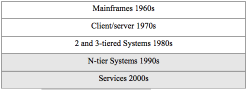

Figure 2.1. Timeline for distributed systems.

We will cover all these architectures in this chapter, but the balance of the book will be concerned with N-tier systems and services. The history does not, of course, exactly match the decades listed in our timeline, but it is a good approximation for us to locate the various eras.

### Mainframes (1960s)

At least in the beginning, a commercial mainframe meant that there was only one central processing unit (CPU) for use in an organization. One had to write programs using punch cards (see figure 2.2) and see the output from a printer. A punch card is a stiff piece of paper that has digital information encoded on it by the presence or absence of holes in predefined positions on the card. It was actually an evolution of technology used for controlling textile looms developed in the late 19th century. One used a key-punch machine with a keyboard to type in the program which ended up as holes in a stack of cards. Then one fed the cards into a card reader machine that read the cards and sent the program to processing on the mainframe. After a wait while one's job sat in a queue on the mainframe, it was processed and the output printed. A computer operator typically took the printout and put it into a mailbox-
like cubby where one could retrieve it.

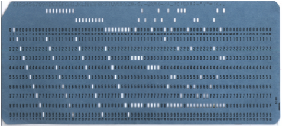

Figure 2.2. A punch card.

In the 1960s, cathode ray terminals were developed that allowed users to type their programs directly to the mainframe and view the output on the screen which was much more convenient. There was still only one CPU (or several in one box), however, and so the idea of a distributed system was fairly primitive. The terminals used for access were 'dumb'
terminals meaning that they had no CPU themselves.

A mainframe system was typically composed of a separate front-end processor to multiplex the inputs and output for the dumb terminals, a mainframe box for the CPU, with separate tape and disk drives (see figure 2.3). At that time in the 1960s and early 1970s, networking was done using the telephone service. Asynchronous modem communications were used to transmit digital information over the telephone lines. Modem communications involved encoding the digital data on the analog telephone signal and transmitting the characters one at a time. One computer networking standard that was developed during that time by IBM was a standard encoding for characters using 8-bits called the extended binary-coded decimal interchange code (EBCDIC). It was later replaced by the 7-bit american standard code for information interchange (ASCII) but it was basically the same concept. There was no real distinction between local area and wide area networking.

### Client/Server Computing (1970s)

The 1970s saw the development of minicomputers, Ethernet, and X.25.
Minicomputers were smaller computers so there could be more of them in organizations. Ethernet was the beginning of the distinction between local-area (LAN) and wide-area networking (WAN). Ethernet, which you covered in your basic networking class, formed the LAN where minicomputers could communicate as client and server. A client is a requestor process (not a machine) and server is a responder process (again not a machine or host) where both must have CPUs in a 2-tier architecture. A WAN technology called the X.25 service was developed as the first packet-switching network for digital data.

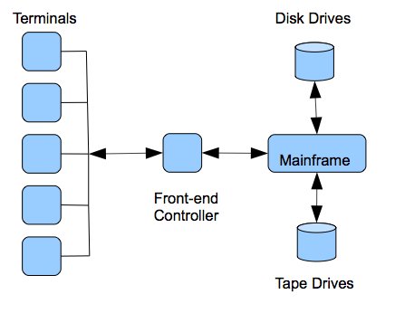

Figure 2.3. Mainframe Architecture.

The 1970s also saw the beginnings of the Internet with the development of ARPANET in 1969 that connected computers primarily at universities and department of defense sites. The basic TCP/IP stack was formalized in 1978.

### 2 and 3-tier Systems (1980s)

The first real and wide spread distributed systems began to appear in the 1980s. The IBM PC appeared in 1981 and was revolutionary in that everyone could now have a computer and they could be networked as a LAN.
Novell developed NetWare which became the major LAN operating system that provided file and print servers in the first really wide spread implementation of a client/server architecture consisting of IBM PC clients running MS-DOS with NetWare file servers. For the unix-based minicomputers, the network file system (NFS) was developed in 1985 which was the first distributed file system. We will cover distributed file systems later in the book. LANs started to be connected to ARPANET using TCP/IP (1982) instead of individual mainframe and minicomputers. The domain name system (DNS) was introduced in 1984 and remains the naming system for the Internet today. In 1989, Timothy Berners-Lee developed HTTP which forms the basis of the world wide web (WWW). We will cover web technology in chapter 3.

Figure 2.4 shows an early NetWare server with two NICs for bridging two network segments. A user on PC#1 could type wp at the command prompt which would retrieve the WordPerfect word processing program using a remote procedure call (RPC) from the NetWare server and run in the RAM of PC#1. We can now see the first real example of our definition of a distributed system as a group of networked computers that appears a single system. The user sitting at the MS-DOS client thinks of the system as including the file server in this 2-tier case. We will see an elaboration of this into 3-tier and N-tier later.

The late 1980s also saw the rise of inter-networking technologies like bridges and routers which allowed the creation of networks with more complicated topologies. These topologies resulted in true 3-tier systems with an architectural middle tier between the client and the server called the application server and associated middleware. Middleware is simply computer software that runs 'in the middle' and offers services to distributed systems that are between the 2nd and the Nth tier. It is what allows a distributed system to appear as a single system to a user.
Middleware does not have to reside in a tier as we will see below but is typically distributed among the tiers to offer the same services and interface to all nodes. See figure 2.5. The major types of middleware are:

-   RPC and Object Middleware
-   Message-Oriented Middleware

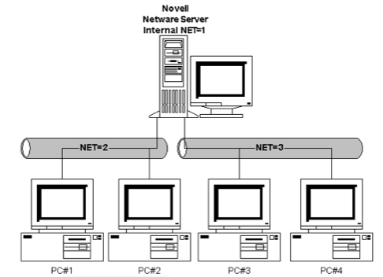

Figure 2.4. A NetWare network.

### RPC and Object Middleware

RPC is a middleware service that allows an application programmer transparent access to procedures on servers on the network as if they were local procedure calls. The RPC middleware software architecture does this in such a way that special compilers are not needed. A programmer simply writes programs that call procedures and the RPC middleware handles remote calls. Figure 2.6 shows the basic architecture of RPC.

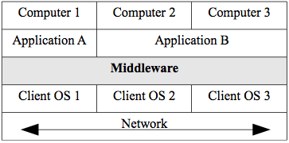

Figure 2.5. Middleware.

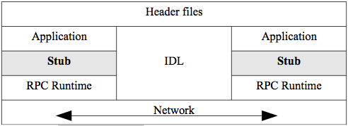

Figure 2.6. RPC Architecture.

The application calls the remote procedure locally at the stub. The stub intercepts calls that are for remote servers. The stub packs all parameters into a flattened representation defined by the RPC standard.
These are called marshalled parameters. The interface definition language (IDL) handles translating everything (parameters, code,
headers) to a neutral representation for transfer. RPC can be used between nodes with different operating systems that can have basic differences in representation such as different ways of handling real numbers etc. The RPC Runtime handles the transfer. The programmer is oblivious to all the networking details. Where a local procedure call may pass parameters by reference to memory locations, RPC always passes explicitly by value since the programs do not share memory.

In terms of timing, the RPC protocol is synchronous or blocking. This means that when a client makes a remote call, the calling process blocks or waits until it gets a reply.

Distributed file systems are a type of RPC middleware such as the network file system (NFS) mentioned earlier. This kind of middleware allows users to mount directory subtrees from remote computers into their own local directory tree. It appears to the user as if all the files and directories are local even though that is not the case.

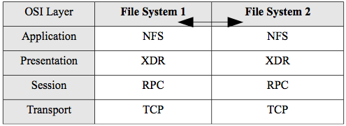

Figure 2.7.The NFS distributed file system.

Figure 2.7 shows that a file system 1 can mount directory subtrees from file system 2 using the NFS protocol. NFS is actually a suite of protocols RPC, XDR, and NFS operating at various layers of the OSI model. RPC handles the network transfer, external data representation (XDR) handles the details of converting incompatible formats of files from differing operating systems, and NFS handles the interface with the file system. Note that pattern again of calling a stack of protocols by the name of one (or a couple) of the protocols.

A very common kind of database RPC middleware that uses an explicit 3-tier architecture is transaction middleware. A transaction is a unit of work of possibly many steps that must be completed successfully in its entirety (committed) or rolled back to its previous state. For example, if you have a savings account and a checking account, there are at least 2 steps involved in transferring money from one to the other.
If the savings account has $1000 and checking account has $500 and you want to transfer $500 from savings to checking, we could define the following simplified transaction:

-   withdraw $500 from savings
-   deposit $500 to checking

If there was a computing or network failure between step 1 and step 2,
without the concept of a transaction, $500 would be lost. With transactions, however, that failure would result in a rollback that leaves the accounts in their original state. Transaction middleware is usually deployed as an application server called a transaction processing monitor (TPM) in the middle tier.

Figure 2.8 shows the 3-tier architecture using a TPM. This involves the concept of 2-phase commit which is important for distributed systems. In this case, the steps of a transaction are not only multiple but distributed over multiple servers that perform the steps. The client makes a request for a transaction to the TPM application server in the middle tier which in turn requests that the relevant step(s) be undertaken by each of the servers. The TPM monitors the results of the transaction in order to commit the entire transaction or roll back if any part fails. Each server performs its own subset of steps and reports to the TPM whether it commits or rolls back. The TPM waits until all the servers report back and either commits or rolls back so the two phases are (1) the individual processing of the sub-transaction by each server and (2) the TPM processing of the entire transaction. Note that the synchronous nature of RPC is especially good for transactions since we do not want there to be any delays.

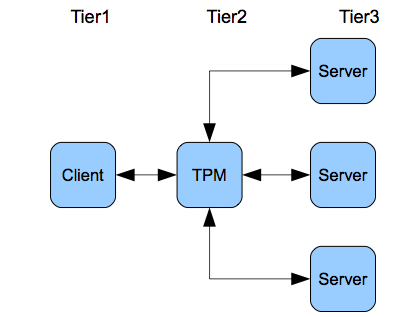

Figure 2.8. The TPM.

In the 1980s, when object-oriented programming became standard, RPC-
based distributed systems became based on object-oriented principles.
The most important of these was the common object request broker architecture (CORBA) system. The middleware concept was that an object request broker (ORB) mediated a method call from one object to another object on the network. All objects would register with the ORB. Figure 2.9 shows the architecture of CORBA.

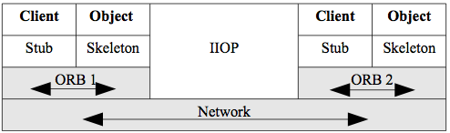

Figure 2.9. CORBA.

Client objects can call methods from server objects. Note the similarity to plain RPC in that the client has a stub. The server object has a skeleton, but that is just a peculiarity of terminology for CORBA - it is a stub also. Note also that different ORBs can communicate using an application layer protocol in the TCP/IP stack. The internet inter-ORB protocol (IIOP) allows ORBs from different vendors to communicate over the Internet.

CORBA basically died out in the 1990s due to complexities of implementation and integration. It was replaced by SOA using services which we discuss in most of the rest of the book.

### Message-Oriented Middleware

MOM or message-oriented middleware sends messages between hosts in a distributed system as the name suggests. An important effect of this message passing is that MOM supports asynchronous communications. This means that a host can send a message that might contain a procedure call as with RPC, but that host process does not have to wait or block until it receives a response. The process just goes back to processing and is interrupted with a callback message when it does get the response.

This asynchronous behavior is good for many use-cases. It offers more flexibility in not requiring an immediate response. For example, a host does not even need to be available to receive a message in its queue,
but can service the queue contents when it does come up. It is not good for every use-case, however. It is typically more complex to program and is not good for time sensitive applications such as transactions. MOM shows a more loosely-coupled design pattern in that it does not require such tight integration as RPC. We will be exploring this design pattern extensively later in the book.

There are two types of MOM:

-   Point-to-point messaging (PTP)
-   Publish/Subscribe messaging (pub/sub)

PTP messaging has the structure in figure 2.10a. The main point is that messages are sent to a queue, rather than directly to the intended receiver. A queue is just a waiting list that is maintained to hold the messages until the processor is ready for them. They can be serviced in any order such as 'first come first serve' or by priority.

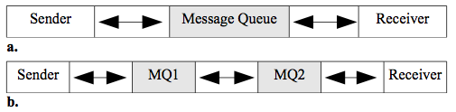

Figure 2.10. Message Queues (MQ).

Figure 2.10 shows two scenarios where the first (a) has the sender and receiver share a MQ, while the second (b) has each host maintain a queue and the queue processor/manager can send the messages to another queue.
Commercial examples of MOM are IBM's MQSeries and their more modern WebSphere Message Broker (WMB). Another example is Microsoft's MSMQ.
Open source APIs for MOM include the java message service (JMS). One difficulty with MOM is the lack of standards. There is no standard protocol or message format and each vendor or developer has their own implementation. An emerging standard for MOM is the advanced message queuing protocol (AMQP) that defines a protocol and message format so that different implementations are interoperable.

It is important to note here that all middleware is really based on RPC.
CORBA is an object-oriented layer on RPC and MOM uses queues to give asynchronous communication from the viewpoint of the sender and receiver. For example, in figure 2.10b, the sender will use RPC to send a message to MQ1. Then the MQ1 sends the message to MQ2 (either locally or on the Internet) which delivers the message to the receiver. So from the point of view of sender and receiver, the behavior is completely asynchronous, even though every link may use RPC.

The second type of MOM is pub/sub. Publish and subscribe middleware allows any host to subscribe to a topic on a publishing server. Once that is done, the server will send any message on that topic to that host without being asked. In this way, the server can send out messages to a large number of hosts whenever the defined topic has been updated.
This kind of MOM is very scalable and event-driven. It is a simple example of what is known as push technology where the normal pull pattern of client/server systems is changed so that the server can contact the client proactively. We will discuss push technology in chapter 8.

An open source example of pub/sub is PubSubHubbub which extends the Atom and really simple syndication (RSS) protocols for data feeds. A subscriber pulls a feed in the normal way and if desired, it subscribes to the hub publishing server. Then, whenever the feed is updated, that server can push or notify the subscriber. We will take a look at Atom and RSS feeds later in chapter 6.

### N-tier Systems (1990s)

The 1990s saw a rapid growth of networking in general and the Internet in particular. Bandwidth increased dramatically. For example, LANs went from 10 mbps to 100 mbps to 1000 mbps. ARPANET was replaced by the publicly available Internet in 1990 and the first internet service providers (ISPs) appeared. The Internet grew dramatically and had a fundamental effect on the evolution of distributed systems. Prior to the Internet, WANs were very expensive. Organizations would have to lease private lines or services from telecommunications vendors and the price was prohibitive for all but the largest organizations. The Internet allowed WAN access to everyone. The WWW became widespread using HTTP,
hypertext markup language (HTML), and URLs/DNS which was a great success with both organizations and individuals. This combination created a boom in e-commerce that continues today. In 1996 the Unicode encoding was created that allows 16-bit characters and is the current standard for the Internet. This decade also saw the development or wide adoption of distributed naming systems such as the domain name system (DNS) for the Internet and the NetWare directory services (NDS) in 1994 for LANs. We will discuss naming systems in more detail in chapter 8. Microsoft became dominant in operating systems and networking for PCs. Java became a dominant programming language after introduction in 1995.

N-tier systems are not a different approach than 3-tier systems, they are just an elaboration of the same pattern. All the technologies and middleware discussed to this point are relevant. In particular,
web-based systems introduced a tier for the web server. Note the introduction of the web server tier into the previously 3-tier architecture in figure 2.11. Figure 2.11 also introduces the concept of logical tiers and physical tiers. The left-hand name shows the logical interpretation of the tier and the right-hand shows the physical interpretation.

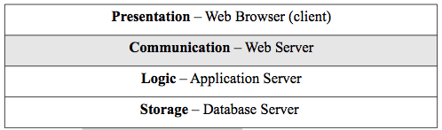

Figure 2.11. The Web Tier Architecture.

For example, the web browser is a very thin client and is a specific piece of software and so is a physical interpretation. Its function is to present information to the user and the logical interpretation is as a presentation tier. Similarly, the physical web server has the function of mediating requests from the browser to the application server and so the logical name for the tier is communication for its function.

The late 1990s also saw programming environment developments for Java,
Microsoft, and web scripting. Strictly object-oriented programming software technology changed to a component model for both Java and Microsoft. Java developed the J2EE framework architecture which has the concept of a container that offers general non- functional services and a runtime environment for the objects (enterprise java beans - EJBs)
that it contains. The component model gives more structure and more reusability compared to a plain object-oriented approach (plain old java objects - POJOs). The EJB Container provides the deployed beans with services such as persistence, transaction handling, connection pooling,
security, exception handling and so on. At runtime, the EJB Container creates instances of the bean class, that are bean instances, and manages their life cycle. Figure 2.12 shows the structure of the J2EE framework. The Java naming and directory interface (JNDI) is a naming service for containers. The Java messaging service is how Java frameworks offer MOM and remote method invocation is the Java framework version of object-oriented RPC. Note that a container can contain many beans. Microsoft has a very similar component architecture for their .NET framework. The main thing to understand about containers is that they increase productivity and reusability by giving programmers a framework for their object code. They will be important for SOA.

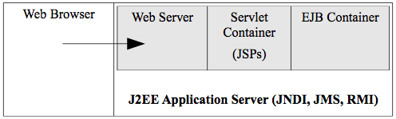

Figure 2.12. EJB Container in J2EE.

Web scripting also becomes very important in this period. It usually goes by the acronym LAMP with the following definitions.

-   L - the operating system. L stands for Linux as the most common one, but any operating system can be used such as Windows.
-   A - the web sever. A stands for Apache as the most popular open source web server, but any web server may be used.
-   M - the database. M stands for MySql as a popular open-source relational database, but any database may be used.
-   P - the scripting language. P originally stood for Perl which is a     popular scripting language and oddly enough, many scripting languages begin with P such as Python and PHP. Any scripting     language may be used, however, such as Ruby. Scripting languages are characterized as interpreted and dynamically typed.

We will discuss scripting approaches to web-based distributed systems in chapter 3 and get an introduction to PHP, a popular scripting language used with HTML.

###Services (2000s)

Service-oriented architectures (SOA) became the goal in the 2000s. SOA does not require any specific technology but is a set of design principles. An abbreviated list of these principles follows:

-   Standard service contracts - participant have agreements. They should also be discoverable by using some kind of registry or     directory. We will see how this works in xml web services in later chapters.
-   Loose coupling - We have already seen this crucial concept where the participants have minimal dependencies on each other.
-   Encapsulation - Services should hide their logic from the outside world as a black box. This increases reusability and increases composability (combining services). Services should also have location transparency where users do not care where the services are located.
-   Statelessness - Keep track of as little state as possible. This is a requirement for loose coupling and encapsulation.

XML web services implement SOA and are the subject of much of the rest of the book. This is a specific XML-based technology framework that standardizes the XML interfaces between heterogeneous systems that can be implemented in any programming framework such as J2EE, .NET, or web scripting. These interfaces are separated from the implementations and are typically transported with the standard web protocol HTTP. The basic XML wire protocols for web services are SOAP, WSDL, and UDDI. The requestor uses the UDDI protocol to find the service it needs and then uses the WSDL protocol to figure out how to call and use it. The SOAP protocol is used to make the actual request. We will cover XML web services in detail in chapters 4, 5, and 6. Figure 2.13 shows the simplified architecture of XML web services.

It is important to understand that the pattern of XML web services is fundamentally different than normal web operations. In normal web operations, a browser makes a request to a web server for a page or an application, the result of either is a returned web page for a human to view. For XML web services, a program sends a request using SOAP and receives the result as another SOAP message. It is not oriented to the human user but the program. While the normal web operations are needed for business to consumer (B2C) e-commerce, XML web services are crucial for business to business (B2B) interactions such as automating business processes.

### Markup Languages

XML is a markup language as is HTML. In order for us to understand the technology at an appropriate technical level, we need to study how markup languages work.

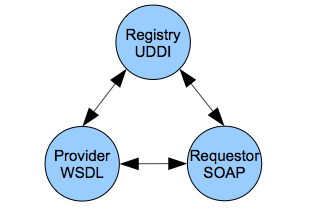

Figure 2.13. XML Web Services Architecture.

In 1989, Tim Berners-Lee invented HTML with which we are all familiar from web pages. He created HTML from standard generalized markup language (SGML) that was invented by an IBM researcher in the 1960s. It had the same basic structure that markup languages still have today. The markup are tags or elements that are separate from the contents of the document. The terminology tag is probably most common, but the more formal one is element. In any case, they refer to the same thing and can be used interchangeably. A sample of markup is:

`<section>Section I</section>`

Angle brackets are used to delimit the tags and each tag (or element)
has an opening and a closing version with a slash. There a few syntactic rules for markup and a document that complies with these is called well-
formed. It is important to understand, however, that SGML is really a meta-markup language. This means that it is actually a language for defining other languages. A specific markup language is a list of tags and rules about how they are composed. SGML does not pre-define tags,
but allows one to create them at will. One creates a set of tags and their structure in document type definition (DTD) document and that is the schema for a specific markup language. An SGML document that correctly follows a DTD is called valid. A document must be well- formed before it can be valid.

So Tim Berners-Lee created a DTD from SGML for a language called HTML for use on the web. HTML was designed to format web pages and most all the tags of HTML are used for formatting. For example, the following HTML markup makes the content text bold.

`<strong>the brown fox</strong>`

SGML was a very specialized and rather esoteric topic before HTML. With the popularity of the web and the dramatic growth of the Internet, HTML became very mainstream for distributed systems. As especially the B2B operations on the web grew, users became dissatisfied with the SGML foundation. SGML was created in the 1960s and was not optimized for the web. So in 1998, the XML 1.0 standard was created as a version of SGML that was optimized for the web and shed many of the unused or now irrelevant parts of SGML. XML is a meta-language like SGML and HTML has now been reformulated as a DTD of XML and is commonly called XHTML. XML retains DTDs for validity and has added a more modern schema language called XMLSchema. We will learn XMLSchema in chapter 4. Here, we will learn XML and DTD validity.

### XML Tutorial

This section briefly introduces XML and validity using DTDs. See the on-line syllabus for links to additional information and examples. The w3schools XML tutorial (http://w3schools.com) will be especially important. Well-formed XML documents must comply with standard rules of syntax. Some of the most important are:

-   It contains only properly encoded, legal Unicode characters.
-   None of the special syntax characters (<, &) appear except when performing their markup-delineation roles.
-   The begin, end, and empty-element tags that delimit the elements are correctly nested, with none missing and none overlapping.
-   The element tags are case-sensitive - the beginning and end tags must match exactly.
-   There is a single “root” element that contains all the other     elements.

XML documents may also be valid if they conform to a DTD (or XMLSchema).
The best way to see how an XML document works is to look at a simple example in listing 2.1. The shiporder document models a purchase order (PO). The PO defines an orderperson, a shipto address, and a list of items to be shipped. Note the following about that document and follow up the concepts with the links in the syllabus. It is important to understand each bullet relative to the sample document in the figure.

-   The declaration in line 1 is contains question mark characters and is called a processing instruction. It references the version and encoding for the XML document. 
-   Line 2 has a reference to an external DTD file that contains the     DTD.
-   Line 3 is the root tag for the document. Note that it contains an attribute. Any XML tag may have an attribute and it must be quoted.
-   Note that even though item is repeated, it uses the same tag. Never create tags like item1, item2, etc.

Listing 2.2 shows the DTD that must be in the file shiporder.dtd according to the XML document declaration. Again, reference the following bulleted list against listing 2.2.

-   The declaration of the DTD in the XML document has the syntax where SYSTEM refers to that fact that the DTD is a private implementation for this document rather than a standard. It would change to PUBLIC if it was a standard as: `<!DOCTYPE root-element SYSTEM "URI" >`
-   DTDs do not have XML syntax. They have their own syntax.
-   The !ELEMENT declares an element (also called a tag).
-   The child elements of a tag are declared as an ordered list in parentheses. If an element can be repeated 1 or more times, it must have a plus sign (+) after it. The character star (*) means 0 or     more and so makes elements optional.
-   A leaf node of the hierarchy is declared #PCDATA which means parsed character data and it is the text of the content.
-   The < and > are XML entities for the less than and greater than (< >) characters. XML markup characters cannot be used because     they would confuse a parser, so these pre-defined entities must     replace them.
-   There are no data types in DTDs. Everything is text.
-   The !ATTLIST declares an attribute for an element and typically declares it as CDATA which means character data. This means that the XML parser does not parse it.
-   One can require a document to have an attribute in order to be valid by using #REQUIRED 

        < ?xml version="1.0" encoding="utf-8"?>
        <!DOCTYPE shiporder SYSTEM "shiporder.dtd">
        <shiporder orderid="889923">
             <orderperson>John Smith</orderperson>
             <shipto>
                 <name>Ola Nordmann</name>
                 <address>Langgt 23</address>
                 <city>4000 Stavanger</city>
                 <country>Norway</country>
             </shipto>
             <item>
                 <title>Empire Burlesque</title>
                 <note>&lt; Special Edition &gt; </note>
                 <quantity>1</quantity>
                 <price>10.90</price>
             </item>
             <item>
                 <title>Hide your heart</title>
                 <quantity>1</quantity>
                 <price>9.90</price>
             </item>
        </shiporder>

Lisitng 2.1. Sample XML document.

    <!ELEMENT shiporder (orderperson, shipto, item+)>
    <!ELEMENT orderperson (#PCDATA)>
    <!ELEMENT shipto (name, address, city, country)>
    <!ELEMENT name (#PCDATA)>
    <!ELEMENT address (#PCDATA)>
    <!ELEMENT city (#PCDATA)>
    <!ELEMENT country (#PCDATA)>
    <!ELEMENT item (title, note*, quantity, price)>
    <!ELEMENT title (#PCDATA)>
    <!ELEMENT note (#PCDATA)>
    <!ELEMENT quantity (#PCDATA)>
    <!ELEMENT price (#PCDATA)>
    <!ATTLIST shiporder orderid CDATA #REQUIRED>

Listing 2.2. The DTD for the sample XML document.

This is a very brief orientation to XML and DTDs, but the end of chapter exercises will add detail to your understanding. One important fact about DTDs is that their formal syntax allows a computer program (a validator) to check for validity. We can check this example using the program xmllint which is available on gl.

`$>xmllint --noout --valid shiporder.xml`

The program xmllint can find the shiporder.dtd file due to the declaration in the XML file. It returns the text of the XML document if the document is valid and and error if not. The -noout switch suppresses the output of the document and so nothing will be returned if valid. The - valid option tells xmllint that we are using DTDs for validation.

XML DTDs are used to define the XHTML standard as we will see in the end of chapter exercises. The XML wire protocol languages that will be used for XML web services are defined as valid XML as we will see in later chapters. For example, SOAP is an XML document that is defined and must be validated according to a standard schema. It uses the alternative and more modern method of validation, however, XMLSchema which we will cover in chapter4.

### Java ObjectScript Notation 

Java ObjectScript Notation, commonly referred to as [JSON](https://www.json.org/json-en.html), is a lightweight, text-based, human-readable format for data representation. It is widely used in distributed applications and in many cases it has replaced XML. It is very widely used in web services, particularly RESTful web services.  Listing 2.3 is a simple JSON example.  Note the following: 
- JSON is a more compact notation than XML. 
- JSON provides for the use of arrays. 
- JSON is easier to parse than XML. JSON can be parsed directly by Javascript. XML generally requires the use of a parser, although it is included as part of the base functionality in some programming environments. 

    {
      "array": [
        1,
        2,
        3
      ],
      "boolean": true,
      "color": "gold",
      "null": null,
      "number": 123,
      "object": {
      "a": "a value",
      "b": "b value"
  },
  "hello_string": "Hello World", 
  "name_string": "PHC"
}
  
Listing 2.3. Simple JSON Example

### Chapter 2 Exercises

Do the end-of-chapter exercises for each chapter of the book by following the link in the on-line syllabus.
