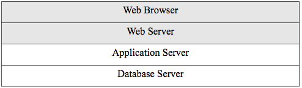
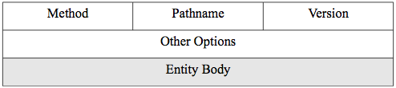
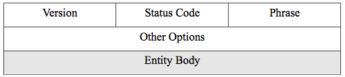
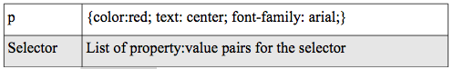
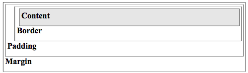
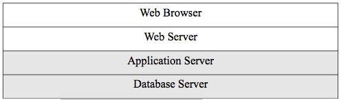
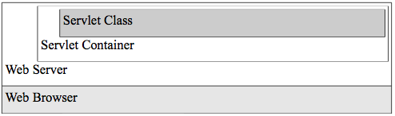

## Chapter 3 - Web Technologies

### Introduction

Since web technology is so central to distributed systems and forms the basis for XML web services, we will review it in broad outline in this chapter. We will cover HTML/CSS, javascript, and web application servers. This is a lot of ground, but our goal here is to understand the technology at a technical level, but not to become expert web programmers or developers. The World Wide Web Consortium (W3C) is the main international standards organization for the World Wide Web. Figure 3.1 shows the basic web architecture.

Figure 3.1. Web Architecture.

Our focus in this section is on the web browser and web server. In the next section, it will be on the application and database server tiers.
Let's review how the networking works for a web request. The web bowser uses the universal resource locator (URL) entered into the address box (or the link clicked on) to create a request to the web server. A URL has the following structure:

`http://zaad2.umbc.edu:80/path/file.html`

The http:// denotes the protocol to be used, clearly HTTP here. The zaad2.umbc.edu is the host name for the web server. Remember that this must be translated to the IP address by the DNS before the request can be sent. The IP address in this case is 130.85.90.82. The :80 is the port number. Since port 80 is the default port number for web servers,
it can be optionally omitted, but web servers can actually be installed on any other free port and in those cases it must be included. The 'path/file.html' denotes the full pathname from the root of the web directory to the requested file. For example, in your gl account, it would be the full path from under the swe2016 directory. If a file is in the root of the web directory, then the full path is just the bare file name. Web servers can be configured to have a default file returned if no filename is requested and by convention that is usually index.html.
So the URL http://zaad2.umbc.edu/ will return the file index.html from a web server root on port 80. URLs are uniform resource locators and are a type uniform resource identifiers (URIs). The other type of URI is a uniform resource name (URN).

The client web browser then sends the HTTP request to the web server.
Figure 3.2 shows the simplified header structure and body of the HTTP request.

Figure 3.2. HTTP headers and body for a request.

The HTTP method is from a set of commands defined in the HTTP standard.
The method to ask for a file is GET. The method to send something up to the web server as from an HTML form is POST. There are 9 different methods. In the current scenario, we are requesting a file and so would use GET. The pathname would be for the requested file under the web root directory. Recall that the protocol here is HTTP, the port number is handled in a lower protocol header for TCP, and the host IP is handled in a still lower protocol header for IP. The version will be HTTP/1.1.
The other options are typically a series of header lines with various information pertaining to the connection. For example, a common header line is the header field name Accept: and a value that is a list of the type of objects (MIME types) the client is prepared to accept such as text/html, imge/jpeg, etc. We will do an exercise at the end of the chapter to see these header lines. Since this is a request and we are not sending anything to the web server, the entity body is empty.

The web server receives this packet and uses the information to find the file (or return an error) and creates an HTTP response shown in figure 3.3. The version is HTTP/1.1. The status code is a standard code for the response. For example, a status of 200 means the request succeeded and the file is returned. There are a number of other status codes for errors. Among the most common are 404 for 'file not found' and 500 for server error. The phrase is simply an english version of the status code - for 200 the phrase is 'OK.' The other options include headers lines just as in the request.

Importantly, the HTML of the requested file goes into the entity body of the response packet. When the web browser receives the HTTP response, it displays the contents of the entity body after parsing and rendering the HTML. Of course, any images are retrieved separately and combined by the render operations of the browser.

Figure 3.3. HTTP headers and body for a response.

### Client-side Web Technologies

As we already know, HTML is the language of web pages. In this section,
we will review HTML and the associated client-side technologies of cascading style sheets (CSS), and javascript. All of these are client-side in the sense that they are implemented in interpreters within the web browser. See the syllabus for links and references.

HTML is the fundamental markup language for web pages. We will use the w3schools tutorial for our HTML reference and the instructions for navigating the materials there will be discussed here and then we will look at a complete example. We are not concerned with memorizing all the HTML tags but you do need to be able to use the HTML tutorial at w3schools to look up any tags that you need. Look over all the tags presented in the HTML Basic section and become familiar with them. This covers the HTML4 standard which is based on SGML. We will want to actually write XHTML for our exercises and there is also a section for that at w3schools. If you look in that section, however, you will see that it includes no tag descriptions. This is because the tags are basically the same (although some have been depreciated) but there are stricter rules for syntax that match those for XML that are discussed in the XHTML section. So use the HTML section for your tag reference and follow the syntax rules from the XHTML section. We will discuss HTML5 at the end of this chapter.

A major goal in writing modern HTML is to write semantic HTML that emphasizes the meaning of the encoded information over its presentation.
Many use the funny acronym POSH for plain old semantic HTML to describe this style. It means that one uses bare HTML tags to describe the structure of the web page and uses CSS for any presentational details.
For example, the ul tag is for creating unordered lists and is a semantic tag. The font tag is an example of a non-semantic presentational tag and so is depreciated in later versions of HTML.

CSS should be used to set the presentational properties of an HTML page.
This includes things like colors, fonts, layout, alignments, borders,
etc. There is a tutorial for CSS (you do not need to read the CSS3 one)
at w3schools and you should become familiar with the CSS Basic, Styling,
and Box Model sections. Again, the goal is not to memorize everything but just to familiarize oneself for later reference. There are just a few basic principles that are reviewed below. You are not tested on specific tags, styles, or programming, but you should be able to read and understand all the examples in the book.

The first version of CSS as CSS1 was completed in 1996 and the most current version is the third version as CSS3. CSS does not have a syntax based on HTML or XML. It has its own syntax that defines a selector (tag or class or id) and then declares a variable list of properties and values for that selector inside curly braces.

Figure 3.4. CSS Syntax.

As you can see from the on-line tutorial, there are a large number of properties and so the goal is to become familiar with the basic use of CSS and then look up the ones you might need.

CSS stylesheets are called cascading because they have a cascading order where the different kinds of stylesheets take priority and override a previous one. The four types of stylesheets with increasing priority are browser default, external, internal, and inline. So an inline definition will override a definition given in an external stylesheet. External stylesheets are separate files with a .css extension, internal ones are included in the HTML page with the style tag, and inline ones are attributes within an HTML tag.

It is important to understand the box model in CSS since all HTML elements are considered to be in four conceptual, nested boxes that can be individually styled.

Figure 3.5 shows the nested boxes and the definitions for each box follows:

-   The content is the element.
-   The padding is the space between the content and the border.
-   The border is a styled outline (possibly invisible).
-   The margin is the space between elements.

Figure 3.5. CSS Box Model.

The w3schools has good tutorial on the box model and this shows a feature and button called `Try it yourself >>` that is common in all the tutorials there. This brings up a single page where you can see the source code and output and dynamically change the source to see what happens. It is a convenient tool for learning the basics of HTML, CSS,
and javascript. For example, go to the CSS tutorial at w3schools, select the CSS Examples section and see a list of examples. Go to the first example set called CSS Backgrounds and select the first example. You can change the source code of the internal CSS stylesheet to background-color: red, click the edit button, and see the result on the right with the red background. Most of the tutorials at w3schools have a separate Examples section that combines all the examples used in that subject area of the tutorial for easy access to the `Try it yourself >>`
tool.

Javascript is an object-oriented, dynamically typed scripting language that can be run by an interpreter inside the web browser and therefore included inside web page code. The actual name of the standardized language is ECMAScript, but most people use the javascript name.
Javascript used in this way is a client-side technology although there are versions of server-side javascript.

Javascript was originally developed by Netscape for their early browser in 1995 and was called Livescript. It was not being adopted very quickly and in fact, the contemporaneous java technology of applets (which also run in the browser) was getting more attention. So Netscape changed the name to javascript to capitalize on the hype. This added a bit of confusion since javascript really has nothing to do with the java language. It is also ironic since later developments made javascript a crucial and important web technology while java applets are not.

We will again use the w3schools tutorial as our outline introduction to javascript in the JS Basic section. Look over the programming constructs in that section and see that they are very familiar to those in whatever programming language you have learned previously. The goal is for you to be able to read javascript code that is given to you later in the book and use the tutorial as a reference. Be sure and take advantage of the `Try it yourself >>` examples.

Javascript can be included inside the web page directly using the script tag or most commonly, imported from an external file with a .js extension. The power of javascript is that it can script any part of the web page by reference to a model of the page that is put into memory by the web browser. This model is called the document object model (DOM). A programming language such as javascript can access and manipulate any elements using the DOM. The DOM level 1 was standardized in 1998 at the W3C and the current version of the DOM is level 3. There is a separate,
short tutorial at w3schools for the HTML DOM and you should also read this to see how it works.

We will now look at a complete example (listing 3.1) that uses all the client-side technologies to put all these concepts together. The code is commented and that is where you will see an explanation of each part of the script. The document is also available on-line from the syllabus.
Note the following about this example:

-   The DOCTYPE is for the XHTML strict DTD.
-   Both the CSS and the javascript are included internally to the HTML.
    External CSS and javascript are more common for large pages.
-   The onclick attribute is an event that is defined in the DOM.
-   The javascript function is defined from the HTML head and called from an event attribute of the button tag in the body.
-   The example shows that one can change the CSS style by access to the DOM.
-   Note that the internal yellow style tag is overridden by the blue inline style.

Javascript can also be used for asynchronous requests. This means that rather than the javascript just running client-side to manipulate the DOM, it can be used to make requests to a server, receive the response,
and processes it without user interaction or a page reload. The javascript native object XMLHTTPRequest is used to make these asynchronous requests and this mode of operation is typically called by the acronym Ajax for asynchronous javascript and XML.

    <!DOCTYPE html PUBLIC "-//W3C//DTD XHTML 1.0 Strict//EN"
    "http://www.w3.org/TR/xhtml1/DTD/xhtml1-strict.dtd">
    <html>
        <head>
             
             
        </head>
        <body>
             <h1 id='c1' style='color: blue'>Hello World!</h1>
             <button 
                 type="button" 
                 onclick="displayResult()">
                Set text color
             </button>
        </body>
    </html>

Listing 3.1. The javascript example.

The term ajax was coined in 2005 by Jesse James Garrett in his consulting company blog. Ajax can make web applications seem more like native applications due to the complex and behind the scenes DOM manipulations resulting from server interactions. A major use of ajax is to create so-called one-page apps which are web applications where the user goes to the page and manipulates the controls on the page to change display, but the page never reloads.

The w3schools tutorial (see the Ajax Basic and Ajax XMLHTTPRequest sections) for ajax shows the basic use of the XMLHTTPRequest object to make a request and establishing a callback, which is an event listener so that the javascript program can be alerted on the server response. It is this callback that makes the request asynchronous because after javascript makes the call, it goes on processing until it gets the response and then deals with it. Many javascript libraries offer more efficient syntax for the programmer to make ajax calls than the native way seen in the w3schools example and we will see one of these in the end of chapter exercises.

We are using XHTML for most of the examples in this book, but the most modern version of HTML today is HTML5. HTML5 was standardized in 2010 by the W3C. It is different from pervious versions of HTML in being DTD-less. It is not based on SGML or XML. It uses a dummy DOCTYPE as:

`<!DOCTYPE html>`

which is used for compatibility with current browsers. HTML5 adds many features and new tags to HTML and current browsers are moving to support this new version but that transition is not yet complete. We will examine some of the new features of HTML5 in chapter 8.

### Server-side Web Technologies

In this section, we will cover server-side web technologies as in figure 3.6. Application servers for the web must have some way of communicating with the web sever. There are three basic methods:

-   Common gateway interface (CGI)
-   Web server application programming interfaces (APIs)
-   Java Servlet API

CGI was the first method developed in 1993. This allowed web developers to serve dynamic content instead of static HTML web pages. CGI is a standard for communications between a web server and any programming language that has a CGI library. It is very flexible and simple to implement. In the early days of CGI programming, the Perl language was the most popular programming language to use due its strength in string handling. Most all other programming languages now have a CGI library. A major problem with CGI is that it forks a new process for each request which is not scalable. So CGI is a good solution for a quickly deployed and low volume applications. You will implement a simple CGI program in the end of chapter exercises.

Figure 3.6. Web Architecture - server-side.

Fast CGI was a later standard that reduced the resource consumption of plain CGI. Fast CGI creates a pool of persistent processes (connection pooling) for each CGI program, rather than a new process for each request. So a request for the same program hits one of the free persistent processes rather than having to create a new process which is very resource intensive. This makes Fast CGI more efficient than plain CGI.

Server APIs were later developed as plug-ins for web servers that allow the web server process to spin off new threads for each request rather than a process. Threads are much more light-weight than processes so the sever API method is very efficient and more efficient than any CGI method. Since the application program was now running in the same memory space as the web server, communications with the web server are also much improved. This is also the main problem with server APIs, since they are so closely associated with the main web server, they can be the source of instability and security holes that effect the whole web system rather than just the application program.

Netscape created the first API called the netscape server API (NSAPI) in the late 1990s. Microsoft released a very similar API for their web server internet information server (IIS). The popular open-source web server Apache has an API that allows dynamically loaded modules to support programming language integration (such as PHP) and other functions in a plug-in fashion.

The Java servlet API allows a Java virtual machine (JVM) to work as a plug-in to a web server and was first released in 1997. This type of JVM is called a servlet container, so servlets run inside a servlet container which communicates with the web server via the servlet API as in figure 3.7. A servlet is a java class that receives a request and prepares and sends a response. The java servlet API is for HTTP. Servlet containers are thread-based and so are very efficient.

Figure 3.7. The servlet container.

A currently popular server-side scripting language that typically works as a server plug-in via an API such as the Apache module API is PHP. PHP was introduced in 1995 and the acronym originally stood for 'personal home page.' The developers later changed it to be a recursive acronym to stand for php hypertext processor as a kind of nerdy joke. PHP is peculiar in that it has a built in template system for including the PHP code in a web page. This means that one can mix HTML and program code in a page by using special template tags. For example, a special tag is defined as (commonly) <% ... %> were the dots are replaced by program code. Because of the API and the file extension of the web page, a web server knows to pass the contents of these tags to the plug-in for processing. The language plug-in processes the template wrapped code and so that the final page contains only HTML and other client-side code for the web server to return to the client web browser. The special tags for PHP are included natively in the specification for PHP. Many other languages use the same template concept but the template languages are separate. For example, Java server pages (JSP) allows java code to be processed in this way in a servlet container and Microsoft's active server pages (ASP) wraps visual basic (vbscript) or javascript for server-side processing. A PHP web page has a .php extension, the JSP page has .jsp, and the ASP has .asp(x). We will cover PHP in a little bit of detail and use it in our exercises throughout this book since it is available on gl.

### PHP

The PHP Basic tutorial on w3chools shows the basic syntax and examples that you can use to familiarize yourself with the language. Again, the goal is to see how things are put together and not to memorize anything or become an expert. Note that the language constructs of PHP, like any programming language, are similar to the whatever one you have already learned. You should be able to read a commented PHP program and look up anything you need to understand it. So we will concentrate here on important concepts using an example (all examples are live on the syllabus).

As noted above, PHP has a built-in template so that you can include PHP code in a web page. It also offers web integration functions in the basic library since it was designed from the start as a language for web applications. Listing 3.2 shows an abbreviated HTML calling page and listing 3.4 shows the abbreviated PHP page that is called. We will use this example to see many features of PHP relevant to our study of sever-
side processing.

    <form action="651.php" method="get">
        
Choose a number between 1 and 6 for a random friend.

        Friend Number: <input type="text" name="friend" />
        
Give your random friend a last name.

        Friend Last Name: <input type="text" name="lname" />
        <input type="submit" />
    </form>

Listing 3.2. HTML calls PHP.

Note:

-   The form action calls the PHP program 651.php as a relative url.
-   The name attribute of the input tag will be used in the PHP.
-   The HTTP method GET causes a querystring to be appended to the calling URL after a question mark character. The POST method would put the querystring in the HTTP entity body and not in the URL.
-   The querystring is a comma separated list of name/value pairs from the form that are separated with ampersands. So if these pages were in the web root, the calling URL would be:
    `http://localhost/651.php?friend=5&lname=Jones`.

The 2 line text file contacts.csv is shown in figure 3.3.

    Jim, Tim, Sue
    Hege, Time, Qu

Listing 3.3. The contacts.csv file.

    <html>
        <h2>My possible friends are:</h2>
        < ?php
            $f=$_GET['friend']; //line1
            $l=$_GET['lname']; //line2
            $file = fopen("contacts.csv","r"); //line3
            $array=array(); //line4
            while(! feof($file)) //line5
                 {
                     $a=(fgetcsv($file)); //line6
                     $array=array_merge($array, $a); //line7
                 }
            foreach($array as $x) echo $x."<br/\>"; //line8
            echo "
 My random friend is <strong>".$array[$f-1]." ".$l."</strong>
"; //line9
            fclose($file); //line10
        ?>
    </html>

Listing 3.4. The example.php file.

The PHP output is shown in Listing 3.5 after the user enters 4 and Jones in the HTML form. Note that the source of the returned file is only HTML. You should be able to read and understand how this PHP program works after looking up any unfamiliar constructs.

    <html>
        <h2>My possible friends are:</h2>
        Jim<br/\>Tom<br/\>Sue<br/\>Hege<br/\>Tim<br/\>Qu<br/\>
        
 My random friend is <strong>Hege Jones</strong>

    </html>

Listing 3.5. The output HTML.

The first thing to notice is that you can mix PHP code and HTML code,
but straight HTML code must be outside the PHP template tags and HTML inside the tags must be echoed as strings. The echo function writes to the browser. Each note below corresponds to the line number in the PHP program. The line numbers are given as one line PHP program (Figure 3.4) comments behind double slashes.

1. The friend attribute from the HTML form is put into $f. All PHP variables begin with the dollar sign.
2.  The lname attribute is put into $l. Again, the $_GET function makes form processing very easy in PHP.
3.  We are not familiar with file processing in PHP, so we go to     w3schools and choose PHP File from PHP advanced. The simple examples there show us how it works. Alternatively, we can go to the official on-line PHP documentation at php.net/manual/en/ and search for     fopen. Note that the $file variable becomes the file handle for the remainder of the program.
4.  Creates a new empty array variable.
5.  The while loop is delimited with curly braces. The boolean test value of !feof tests for not end-of-file. Search for feof on php.net as above. The ! operator is for logical NOT.
6.  The fgetcsv function gets the file contents line by line and uses the default separator of a comma to create a $a array. We can use w3schools to look this up by going to PHP File and choosing the link at the bottom of the page to PHP Filesystem Reference. Then look up the function on that page. Or use php.net to search for fgetcsv.  This exercise is to show you how to look things up and you will not be tested over all PHP functions (only our examples).
7.  We want all the lines of the file to end up in the same array, so we use array_merge to merge the $a array with $array at each round of the while loop. So at the end, we end up with one array with all the names in it. Go to PHP Array Reference on w3schools or php.net to see the details.
8.  The foreach loop in PHP is always a very easy way to iterate through an array. See it in PHP Basic on w3schools.
9. This line is wrapped due to the book margins, but should really be all on one line. The HTML code must be put into a string and echoed because we are inside the PHP template. The dot is the PHP concatenation operator. Arrays are indexed as in most programming languages from zero, so we have to subtract one since the friend     numbers start with one and the indices start with zero.
10. Always close a file after you are done with it.

PHP is also an object-oriented language. Go to [http://net.tutsplus.com/tutorials/php/object-oriented-php-for-beginners/](http://net.tutsplus.com/tutorials/php/object-oriented-php-for-beginners/)
and look at the entire tutorial. This will introduce you to all the basic syntax and concepts for objects. It should be familiar to you as the same thing you learned in your previous study of a programming language.  Note that the tutorial is for php5. 

This has been a whirlwind tour of client-side and server-side web technologies, but necessary for us to understand the architectures discussed in the remainder of the book at a sufficiently technical level of detail. We will not only describe technologies in this book, but also play with simple programming examples and this will make complex concepts much more concrete. The important thing is to be able to follow the program code given in this chapter.

For the SOAP (chapters 4-6, 10) and REST (chapters 7, 11) web services that we now turn our attention to, it is important to understand that they are not the same as regular operations on the web as described in this chapter, but they use the same technology and infrastructure. Normal web operations are for human users and web services are communicating computer programs in a distributed system. A good way to think of it is as implementing all the patterns from chapter 2 on the web infrastructure described in this chapter 3 under a service-oriented architecture.

### Chapter 3 Exercises

Do the end-of-chapter exercises for each chapter of the book by following the link in the on-line syllabus.
