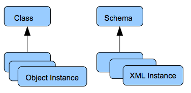
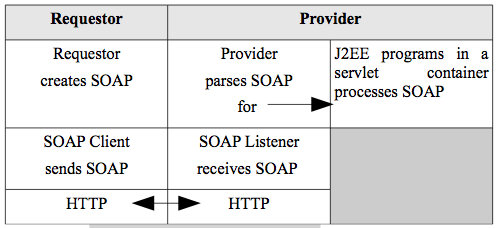

##Chapter 4 - SOAP

###Introduction

SOAP was originally defined as the "simple object access protocol" in 1998 in a Microsoft project, but since is really has nothing to do with objects, it is now just a name and not an acronym. It is the messaging protocol for XML web services and a requestor sends the message to the provider of a service in a service-oriented architecture (SOA) using SOAP. SOAP is a wire protocol that gets information from one place to another at the application layer in a distributed system. SOAP is a standard XML document that encodes that information. SOAP is transport independent and can use any network protocol to carry the XML, but it is almost always used with HTTP using the regular web infrastructure. The SOAP document is put into the entity body of HTTP. This is very convenient since all information systems today connect to the web and already have firewalls configured to pass port 80 traffic. This was one of the big problems with CORBA (chapter 2). Since there was no such common infrastructure in those days, it had to be created from scratch.
Recall IIOP which was the wire protocol for CORBA. Figure 4.1 repeats the general architecture of XML web services under SOA.

The system works like this:

1.  The requestor searches a registry database for the kind of web service that it needs. A standard XML protocol for this search is the universal description, discovery and integration protocol (UDDI). UDDI is not a very popular standard and we will discuss     alternatives for the registry in chapter 5.
2.  When it finds one, it requests a description of that service from the provider of the service. This description tells the requestor how exactly to invoke the service using SOAP. An XML standard for this is the web services description language (WSDL) and we learn this in chapter 5.
3.  Finally the requestor invokes the service using SOAP and the     provider returns the result with SOAP.

Figure 4.1. SOA with XML web services protocols.

When SOAP was first developed, it was used to do RPC-style messaging where for example, the SOAP request made a procedure call and a SOAP response returned the result of the procedure. In those days, there was no XMLSchema and so the SOAP specification included a SOAP encoding that standardized how data structures and types were encoded in SOAP messages. We will see this distinction more specifically in the next chapter on WSDL, but since the adoption of XMLSchema, the SOAP encoding is depreciated and only XMLSchema is typically used to specify types in a SOAP massage now. So we will learn XMLSchema and the related concept of namespaces before we turn back to learning SOAP XML.

###XMLSchema and Namespaces

Recall that XMLSchema is the alternative and more modern method of validating XML documents. We will use the on-line w3schools tutorial on XMLSchema (all sections of Learn Schema) for our examples in this chapter. See the on-line syllabus for further information.

XMLSchema is a schema language that was developed in 2001 and published by the W3C. It has become the dominant schema language today. An older schema language is the one we learned earlier, DTD. Other modern alternatives are RELAX NG and Schematron. A schema language describes a set of rules for a markup language so it can be validated automatically.
XMLSchema has three major differences from DTDs:

-   it has XML syntax
-   it has datatypes
-   it uses namespaces

XMLSchemas, as we will see below, have XML syntax unlike DTDs. XMLSchema files are separate (they cannot be internal) from the XML file(s) that they describe and have the extension .xsd by convention. XMLSchemas also define datatypes unlike DTDs. There are three kinds of types:

-   built-in datatypes
-   simple datatypes
-   complex datatypes

Built-in datatypes correspond to basic fundamental types such as decimal, integer, and string. Simple types can be created for XML elements that contain only text, while complex type can be made up of more complex combinations of elements. See the w3schools tutorial for examples of each. XMLSchemas also support restrictions that can define in detail the acceptable values for any elements or attributes in XML,
such as only integers between 0 and 120. As you can see, XMLSchema is much more powerful than DTDs. It is also the one used with XML web service protocols.

XMLSchema is very similar to a class in object-oriented programming as illustrated in figure 4.2. A class is like a template for creating instances of objects and a schema serves the same purpose and also allows validating those instances.

Figure 4.2. Classes are similar to schemas.

Listing 4.1 shows the very simple schema of the basic note example at w3schools. We see that the example has XML syntax and datatypes, but it also has namespaces. Namespaces are a general concept from programming to avoid name collision. Name collision happens when the same name is chosen mistakenly for two different objects. For example, if you and I were collaboratively programming, but in separate locations, we would have to make up variable names in our program. It might happen that we would sometimes accidentally choose the same variable name for different logical things. In order to avoid this, we can use namespaces where the names must only be unique within the namespace. So if I used the namespace kip and the other programmer used the namespace sue we could choose any name we wanted. We might adopt a prefix convention where our names were prefixed with our namespace to make the name unique as in kip:item and sue:item.

    < ?xml version="1.0"?>
    <xs:schema xmlns:xs="http://www.w3.org/2001/XMLSchema">
        <xs:element name="note">
             <xs:complexType>
                 <xs:sequence>
                     <xs:element name="to" type="xs:string"/>
                     <xs:element name="from" type="xs:string"/>
                     <xs:element name="heading" type="xs:string"/>
                     <xs:element name="body" type="xs:string"/>
                 </xs:sequence>
             </xs:complexType>
        </xs:element>
    </xs:schema>

Listing 4.1. A simple XMLSchema file.

This is exactly what XML namespaces do. In listing 4.1, we see that the prefix xs is used for all the schema tags. The prefix is defined with the xmlns attribute which points to the actual namespace that always has the form of a URL. These namespace identifiers are arbitrary and only need to guarantee uniqueness. They do not need to point to anything on the web. But for standard namespaces like the one for XMLSchema, they usually do point to some documentation as you can verify.

The prefixes are arbitrary and you can make them up, although for standard namespaces, there are usually conventions like the xs in the example although you will often see xsd instead. A default namespace is declared with the xmlns attribute without any prefix. This means that all elements with no prefix are in that default namespace. XMLSchemas are for defining a namespace for the elements in an XML document as we will see below and so the default is reserved for the content being validated.

Recall the note example of Listing 4.1. An xml document that conforms to that schema is:
<?xml version="1.0"?>

<note
xmlns="https://www.w3schools.com"
xmlns:xsi="http://www.w3.org/2001/XMLSchema-instance"
xsi:schemaLocation="https://www.w3schools.com/xml/note.xsd">
  <to>Tove</to>
  <from>Jani</from>
  <heading>Reminder</heading>
  <body>Don't forget me this weekend!</body>
</note>

Listing 4.2. XML Document with a reference to an xml schema (from w3schools).

###SOAP structure

The SOAP XML structure is defined in this section. It is, of course,
defined in an XMLSchema. In listing 4.5, we see that it is defined in the namespace http://www.w3.org/2001/12/soap-envelope and since it is a standard schema, it points to the actual schema for SOAP where all the tags for SOAP are defined.

All SOAP documents consist of an envelope and inside that tag is the optional header and required body tags. Lisiting 4.4 shows an RPC-style request for the procedure GetProductPrice with the parameter of productId. The header includes a requirement that whatever provider gets this message, it must understand the transaction ID.

    < ?xml version="1.0" encoding="utf-8"?>
    <soap:Envelope xmlns:soap="http://www.w3.org/2001/12/soap-envelope">
         <soap:Header>
             <tx:Trans xmlns:tx="http://www.example.org/transaction/"
            soap:mustUnderstand="1">
                234
             </tx:Trans>
         </soap:Header>
         <soap:Body xmlns:m="http://www.example.org/product-prices">
             <m:GetProductPrice>
                <m:productId>450R</m:productId>
             </m:GetProductPrice>
         </soap:Body>
    </soap:Envelope>

Listing 4.4. An RPC-style SOAP document.

Anything in the header modifies or offers services to the main payload in the body. We will see many more examples of the header elements in chapter 6. There are two styles for SOAP messages. We have seen the RPC-style and the other is the document style. The document style sends a complete XML document rather than a procedure call as in listing 4.5.
It is a much more loosely-coupled style than RPC and more congruent with SOA. Figure 4.5 shows a document-style SOAP message.

The Body element is a generic container in that it can contain any number of elements from any namespace. This is ultimately where the data goes that you"re trying to send. Since there are unknown foreign namespaces in SOAP, the schema for SOAP must allow these unknown and unpredictable namespaces. It does this by using wildcard attributes that begin with a ##. For example, ##any is for any namespace. We will take a look at the schema for SOAP in one of the exercises.

<?xml version="1.0"?>

<soap:Envelope
xmlns:soap="http://www.w3.org/2003/05/soap-envelope/"
soap:encodingStyle="http://www.w3.org/2003/05/soap-encoding">

<soap:Body>
<m:GetPrice xmlns:m="https://www.w3schools.com/prices">
<m:Item>Apples</m:Item>
</m:GetPrice>
</soap:Body>

</soap:Envelope>

Listing 4.5. A Document-style SOAP document.

SOAP is now in version 1.2 and people usually refer to that as version 2. SOAP 1.1 is still the dominant version in use, however, and is called version 1. For XML web services, a requestor creates a SOAP message and typically sends it to a provider using an HTTP binding as in figure 4.3.
The XML is standard for all web services participants, but of course,
the actual program doing the web service is written in some programming language that interfaces with the XML - typically J2EE, .NET, or a web scripting framework.

Figure 4.3. Distributed messaging with SOAP.

A SOAP message may go to many different hosts in a distributed system in order to, for example, complete a workflow. There can be only one ultimate receiver, however, that can operate on the body. All the intermediaries can only operate on the header as we will see in chapter 6. The intermediaries typically do things like encryption,
authentication, and authorization. If a service provider gets an error in processing a SOAP document, there is a special fault tag defined in the SOAP schema that goes in the body of the SOAP response and gives information on the error. An example is shown in listing 4.6. You can see the SOAP fault codes at w3schools.

    < ?xml version="1.0" encoding="UTF-8"?>
    <soap:Envelope
        xmlns:soap="http://schemas.xmlsoap.org/soap/envelope/"
        xmlns:xsi="http://www.w3.org/1999/XMLSchema-instance"
        xmlns:xsd="http://www.w3.org/1999/XMLSchema">
        <soap:Body>
            <soap:Fault>
                <faultcode xsi:type="xsd:string">
                    soap:Client
                </faultcode>
                <faultstring xsi:type="xsd:string">
                    Failed to locate method.
                </faultstring>
            </soap:Fault>
        </soap:Body>
    </soap:Envelope>

Listing 4.6. SOAP fault.

Let's look at a example SOAP Web service. The site http://www.webservicex.net/new/Home/Index is a catalog
of web services. You should pick several service and experiment with them. Consider the Periodic Table
service at http://www.webservicex.net/New/Home/ServiceDetail/19. Note that the services has a number of
exposed methods. An exposed method is a method that can be invoked over a network. In this example
the method is invoked using http and soap. Consider the GetAtomicNumber method, http://www.webservicex.net/periodictable.asmx?op=GetAtomicNumber.  The SOAP request message and the
corrsponding response is shown. For example if <i>Hydrogen</i> is entered, the ElementName field in
the SOAP body will have a value of <i>Hydrogen</i>.  

<soap:Body>
   <GetAtomicNumber xmlns="http://www.webserviceX.NET">
     <ElementName>string</ElementName>
   </GetAtomicNumber>
 </soap:Body>

The actual web service resides on the server that hosts the service. The service response is:
<soap:Body>
    <GetAtomicNumberResponse xmlns="http://www.webserviceX.NET">
      <GetAtomicNumberResult>string</GetAtomicNumberResult>
    </GetAtomicNumberResponse>
  </soap:Body>

The string that is returned (for Hydrogen) is:

<string xmlns="http://www.webserviceX.NET"><NewDataSet> <Table> <AtomicNumber>1</AtomicNumber> <ElementName>Hydrogen</ElementName> <Symbol>H</Symbol> <AtomicWeight>1.00797</AtomicWeight> <BoilingPoint>20.400000000000002</BoilingPoint> <IonisationPotential>13.6</IonisationPotential> <EletroNegativity>2.2</EletroNegativity> <AtomicRadius>0.37</AtomicRadius> <MeltingPoint>14</MeltingPoint> <Density>0.08375</Density> </Table> </NewDataSet></string>

You should exercise multiple services and become familiar with the requests and the responses.

###The PHP5 SOAP Client

There has to be a soap client that calls the soap server and optionally there can be an html form that sends the parameters to the soap client. We saw this above with the Periodic Table web service They had an html form that called a soap client which called a soap server that looked up details of the element using a server side resources, likely a small database. Services can be written in any language with a soap library. Services are designed to platform, vendor, and language neutral.

So let's write a soap client for the same Periodic Table web service in php5 on gl which has a built-in soap library. In this case we will invoke the GetAtomicWeight method. To see all the exposed
methods of the PeriodicTable web service see http://www.webservicex.net/periodictable.asmx?WSDL .
See listing 4.7 for the code.

<?php
    $requestParams = array(
        'ElementName' => 'Hydrogen'
    );

    $client = new SoapClient('http://www.webservicex.net/periodictable.asmx?WSDL');

    $response = $client->GetAtomicWeight($requestParams);

    print_r($response);
?>

Listing 4.7. PHP5 Soap.

Listing 4.7 results in:

stdClass Object ( [GetAtomicWeightResult] => 1.00797

)

which is a php object that is returned and can be used in further php processing. The php function `print_r` returns raw php data structures. Remember that you have to view-source if you are in a web browser. The php5 soap library on gl sends an xml soap request in the entity body of an http packet to the remote web service (written in the .NET soap library) which returns an xml soap response. Then the php5 library on gl parses that xml response into the php object you see. You should implement this example in your own gl account.

This is preview of what we will learn next week in that the php5 soap library uses the WSDL xml document from which it gets all the details of namespace, service location, and soapaction. We saw the WSDL document for the Periodic table web service above (http://www.webservicex.net/periodictable.asmx?WSDL). We learn in detail how the WSDL works in chapter 5.

Since the php5 soap library returns a php data structure, we can easily create a more human-readable web page In Listing 4.8, we invoke the GetAtomicNumber method and [return plain xml](https://swe.umbc.edu/~pcomitz/programs/wk4/soapxml_phc.php) .

?php
    $requestParams = array(
        'ElementName' => 'Hydrogen'
    );

    $client = new SoapClient('http://www.webservicex.net/periodictable.asmx?WSDL');

    $response = $client->GetAtomicNumber($requestParams);

    #print_r($response);
    header('Content-type: application/xml');
    echo $response->GetAtomicNumberResult;
?>

Listing 4.8. [Returning XML](https://swe.umbc.edu/~pcomitz/programs/wk4/soapxml_phc.php).

###Chapter 4 Exercises

Do the end-of-chapter exercises for each chapter of the book by following the link in the on-line syllabus.
