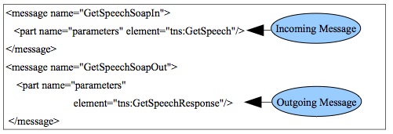
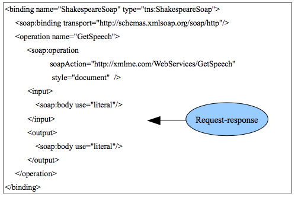
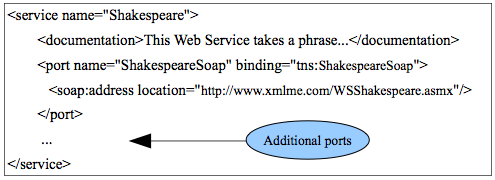
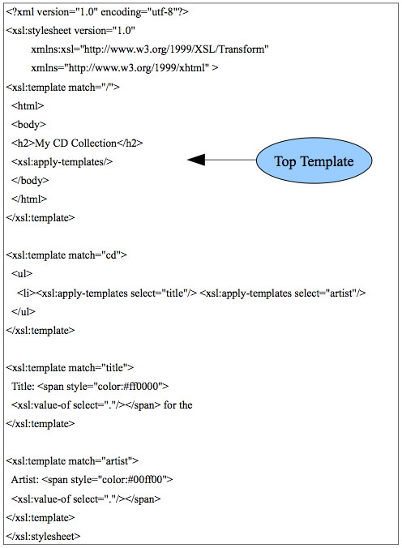

## Chapter 5 - WSDL

WSDL (pronounced "Wisdel") is an XML vocabulary that describes all aspects of web services. It stands for web services description language. Recall that an XML vocabulary is the list of tags that form a specific markup language defined in a DTD or XMLSchema. In XML terminology, we say that WDSL (like SOAP) is an application of XML. WSDL like all web services protocols is created with XMLSchema. It is a crucial part of the system created for web services in that it gives a service requestor explicit documentation on how to create the request.
It is so explicit, in fact, that a computer program can use WSDL to automatically create a SOAP document. In this chapter, we will cover WSDL in detail and briefly discuss the universal discovery description and integration (UDDI) protocol and web services registries in general.
Finally, we will learn another XML standard technology called XML style language transform (XSLT).

A WSDL document consists of seven basic XML elements and we will examine each one. You should know the purpose of each of these elements at the level of detail given below. Listing 5.1 shows the basic structure. The root tag of a WSDL document is definitions and it contains the other 6 tags. The definitions root tag should contain needed namespace prefixes for the WSDL. We will use the running example of the Shakespeare service that we used in the last chapter.

Note the  WSDL for the Periodic table web service at:

 http://www.webservicex.net/periodictable.asmx?WSDL 

which is the standard format for a URL for a WSDL on Microsoft .NET.
View the source for the XML document which is the WSDL. Take a few minutes to examine the WSDL. Note the different tags. 

The types tag contains one or more schema tags as children for the all the types used by the service and defined with XMLSchema. Recall that the schema tag is the root tag for XMLSchemas. The XMLSchema types can be put directly into the types tag or can be imported from an external .xsd document. Listing 5.2 shows an example of the use the types tag using internal XMLSchema types. 

There are many message tags that give an abstract definition of the incoming and outgoing messages to the service respectively. You can see in figure 5.3 that the messages are for an incoming request and the outgoing response. I will suppress the wsdl prefix for the remainder of the examples for clarity - assume it was declared as default as xmlns="http://schemas.xmlsoap.org/wsdl/".

The prefix tns is the conventional prefix for targetNamespace. There may be one or more part tags that are the message payload. So the message tags give the datatypes for the operations.
```wsdl
    <wsdl:types>
        <s:schema
            elementFormDefault="qualified"
            targetNamespace="http://xmlme.com/WebServices"> 
            <s:element name="GetSpeech">
                <s:complexType> 
                    <s:sequence>
                         <s:element minOccurs="0"
                            maxOccurs="1"
                            name="Request"
                            type="s:string" /> 
                    </s:sequence>
                </s:complexType>
            </s:element>
            <s:element name="GetSpeechResponse">
                <s:complexType> 
                    <s:sequence>
                        <s:element minOccurs="0"
                            maxOccurs="1"
                            name="GetSpeechResult"
                            type="s:string" />
                    </s:sequence> 
                </s:complexType>
            </s:element> 
        </s:schema> 
    </wsdl:types>

Listing 5.2. Types.
```



Figure 1. Message

The portType tag describes one or more operations supported by the endpoints. It is also abstract in that it does not define the implementation. It organizes the messages into operations with the operation tag. We have one operation which is the combination of the request and response. In a more complicated service, different messages could be reused in various operations. Listing 5.3 shows the portType for our example.

    <portType name="ShakespeareSoap">
        <operation name="GetSpeech">
             <input message="tns:GetSpeechSoapIn"/>
             <output message="tns:GetSpeechSoapOut"/>
        </operation>
    </portType>

Listing 5.3. PortType.

The binding tag is the first concrete or implementation element. The previous tags are abstract. The binding tag includes information on how the abstract interface is mapped onto an implementation that includes information such as what transport protocol is used (such as SOAP over HTTP). Figure 5.2 shows the binding tag for our example. The second binding tag has the concrete HTTP binding for this service. Note that it is from a different namespace than the parent tag and so even though they look the same, they are entirely different tags. The operation tag here is the concrete version of the one we saw in portType.

The operation tag connects the abstract portType operation and the concrete binding operation through the same name - GetSpeech in this case. The operation tag includes the soapAction, the style and the input and output tags. The style attribute can take one of two values - rpc or document. This refers to the concept that was introduced in chapter 4.
This example has the preferred and loosely-coupled document style. The input/output tags define one of four messaging behavior types:

-   Request-response
-   Solicit-response
-   One-way
-   Notification

These terms do not appear in the WSDL but are inferred from the existence and order of the input and output tags. Request-response is the usual synchronous behavior of the web service. It requires both input and output tags and in that order as in Figure 5.2.
Solicit-response is the reverse of this where the server contacts the requestor. For this behavior, the order of the input and output tags is reversed. For One-way, there is only an input tag. In this case the requestor sends a message but asynchronously does not wait for a response. Similarly, the Notification behavior has only an output tag and the server sends a message to the subscribed requestor. This is the push model we discussed earlier in chapter 3 for the pub/sub pattern.



Figure 2. Binding

There are three allowed of the four logical combinations of the binding style and the soap:body use attribute:

-   RPC/literal
-   Document/literal
-   RPC/encoded

Literal means that the data is serialized according to the XMLSchema while encoded means that the depreciated SOAP encoding is used as mentioned in chapter 4. We will always use the literal serialization format.

The service tag identifies the web service and includes the URL by which the web service is invoked. Figure 5.3 shows the service tag. A provider can host numerous web services with the port tag inside the service tag which defines a combination of transport (SOAP over HTTP in this case)
and network address (URL). Note that the binding attribute in listing 5.1 matches the name from the binding tag. The address is the URL to use for the web service.



Figure 3. Service

This service defines two web services, one for SOAP 1.1 and one for version 1.2. It could also use the same PortType to offer different concrete services such as SOAP over HTTP (the one shown) and SOAP over SMTP (sending the SOAP using email).

WSDL is currently in version 1.2 that is commonly called version 2. WSDL version 1.1 (called version 1) is still more commonly used.

### Registries

We will not cover XML web service registries in detail in this book, but it is important to understand their function in the three-part web services architecture (figure 4.1) . Requestors can search the registries (on-line databases) for information on what web services are available and how to get more detailed information (WSDL) on them. These registries can be public or private to a company. The standard XML-based specification for search of this information is UDDI. Requestors can use SOAP to query a UDDI registry. UDDI is the least successful of the three basic or so-called first-generation XML web services standards. This is largely because there are so many other ways to implement it and many of those ways are already used by organizations. Examples would be regular database processing, web pages and associated applications, or network directories such as Microsoft Active Directory or an X.500 directory using LDAP. We will discuss network directories in chapter 8.

There is a standard for the three basic web service protocols called the Web Services Interoperability (WS-I) basic profile. This defines the core specifications that a service needs to support in order to meet the profile standard. This simplifies interoperability. The core specifications are:

-   XML 1.0
-   XMLSchema 1.0
-   SOAP 1.1
-   WSDL 1.1
-   UDDI 2.0

### XSLT

Extensible stylesheet language transformations (XSLT) is an XML-based functional language that can transform any XML document into any other XML document. It became a W3C recommendation in 2007. Common uses are to transform XML documents into HTML documents for display on the web and to transform XML into different formats required by different endpoints for a web service. The functional character of the language means that it is declarative. Most programming languages you are familiar with are procedural in that they list an imperative sequence of actions. XSLT just defines template rules for matching patterns and the XSLT processor handles the evaluation. We will use the w3schools on-line tutorial for XSLT (XSLT Basic) and XPath (XPath Syntax only). XSLT relies upon the W3C XPath language for identifying subsets of the source XML document tree for transform.

Each of the basic tags of the language that perform various functional operations are described on w3schools and we will go into an example in detail here. We will look at the examples from the XSLT <for-each>
section and the XSLT Apply section. Be sure and take advantage of the Try it yourself>> tool on w3schools for these examples.

XSLT processing can be done on the client or the server. When you create your own XSLT stylesheets in this chapter, you will do it client- side,
since there is an XSLT processor built-in to all modern web browsers.
You must include the XML processing instruction just after the XML declaration in the XML document as in listing 5.4. In that case,
stylesheet.xsl is whatever you call your stylesheet. That file would contain the XSLT code which is also valid XML. Let-s first look at the for-each example from the XSLT Basic tutorial. The source XML document is the CD document we have seen before and a fragment of it is repeated in listing 5.5.

The catalog document can contain any number of CDs. Remember that you would have to include the stylesheet processing instruction in line 2 of the XML if you wanted to implement this example on your own. Our task is to transform it to an HTML table format using the XSLT in listing 5.5.

    < ?xml version="1.0" encoding="utf-8"?>
    < ?xml-stylesheet type="text/xsl" href="stylesheet.xsl"?> 
    <catalog>
         <cd>
             <title>Empire Burlesque</title>
             <artist>Bob Dylan</artist> 
             <company>Columbia</company> 
             <price>10.90</price> 
             <year>1985</year>
         </cd> 
         <cd>
             <title>Hide your heart</title> 
             <artist>Bonnie Tyler</artist> 
             <company>CBS Records</company> 
             <price>9.90</price> 
             <year>1988</year>
         </cd>
    ...

Listing 5.4. The XML.

Note the following about figure 5.5:

-   The default namespace is for XHTML so all the XSLT tags must be prefixed.
-   The root XSLT tag is template. We will include an HTML template and take content from the XML CD document and put it into this XHTML template. In this case, it is an HTML table. The template tag must match the root (or slash) of the CD document to begin with.
-   Each of the remaining XSLT tags will identify content with an XPath statement and put it into the template. The next XSLT tag is for-each. This tag iterates through a series of tags selected using the select attribute and the XPath statement catalog/cd. We are     navigating from the root and this XPath selects all the cd tags     under it of which there are many.
-   Inside of for-each, the value-of tag uses the select attribute and an XPath statement to get the source content and puts it into the template. Only the title tag and artist tag are selected from all those available under cd tag.
-   The result is an HTML table display of the selected information in     the CD XML document which you can see at w3schools.

        < ?xml version="1.0" encoding="utf-8"?> 
        <xsl:stylesheet version="1.0"
            xmlns:xsl="http://www.w3.org/1999/XSL/Transform"
            xmlns="http://www.w3.org/1999/xhtml"> 
            <xsl:template match="/">
                <html>
                    <body>
                    <h2>My CD Collection</h2> 
                    <table border="1">
                        <tr bgcolor="#9acd32">
                            <th>Title</th>th>Artist</th>
                        </tr> 
                        <xsl:for-each select="catalog/cd">
                            <tr>
                                <td><xsl:value-of select="title"/></td> 
                                <td><xsl:value-of select="artist"/></td>
                            </tr>
                        </xsl:for-each> 
                    </table> 
                    </body> 
                </html>
            </xsl:template> 
        </xsl:stylesheet>

Listing 5.5. XSLT -> HTML table.

A better and more manageable way to do this iteration is to use the recursive apply-templates tag instead of for-each. We see an example of this in the XSLT Apply section where the same cd document is transformed to an HTML paragraph format, but I have changed the example to output an HTML list. Figure 5.4 shows the XSLT.

Note the following about figure 5.4:

-   We have the same HTML template, but the only XSLT tag in it is apply-templates.
-   This tag starts at the root of the cd XML document which is /catalog and matches all the templates in the stylesheet recursively.
-   There is a template for cd which includes the HTML unordered list template and further templates to match title and artist.
-   The value-of tag selects the XPath statement of the dot (select="."). This means to take the current tag in the navigation.
    Since we have navigated to /catalog/cd/title at that point, it would select the content for the album title.
-   This use of apply-templates is much more functional in character and preferred to for-each. It also makes for more maintainable code.
-   The HTML output is shown in figure 5.6. Be sure you understand how  the XSLT outputs that HTML.

When you implement these or similar examples yourself and use client-
side processing, you will notice that the HTML will display in your browser, but when you view the source, you only see the original XML - the XML cd document in this case. This is because the XSLT processor in your browser operates on the DOM loaded in memory and of course, the actual XML retrieved from the web server is unchanged. If you did server-side processing, you would see the HTML in listing 5.6. We will do this in chapter 6.



Figure 4. Apply-Templates

    < ?xml version="1.0" encoding="utf-8"?>
    <html xmlns="http://www.w3.org/1999/xhtml">
        <body>
        <h2>My CD Collection</h2>
        <ul> 
            <li>
                Title: <span style="color:#ff0000">Empire Burlesque</span> 
                for the
                Artist: <span style="color:#00ff00">Bob Dylan</span>
            </li>
        </ul> 
        <ul>
            <li>
                Title: <span style="color:#ff0000">Hide your heart</span>
                for the 
                Artist: <span style="color:#00ff00">Bonnie Tyler</span>
            </li> 
        </ul>
        ... 
        </body>
    </html>

Listing 5.6. The HTML output.

XSLT is also used to transform XML documents in web services from one XML format to another when the participants need it. For example, in the PO example we used earlier, one of the participants might be using a different XMLSchema for the PO natively on their system than the one that is used by the web service that processes the POs even though all the actual content is the same. So XSLT can be used to transform the XML to use the appropriate schema at the appropriate time.

### Chapter 5 Exercises

Do the end-of-chapter exercises for each chapter of the book by following the link in the on-line syllabus.
