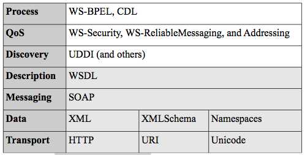
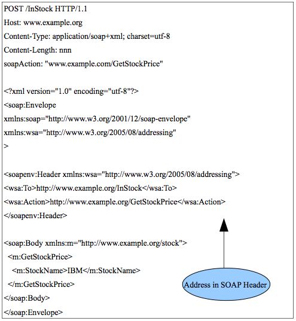
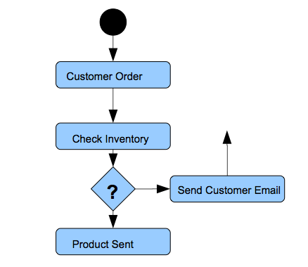
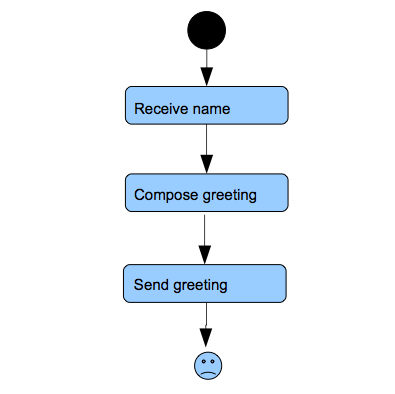
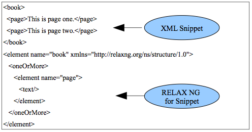
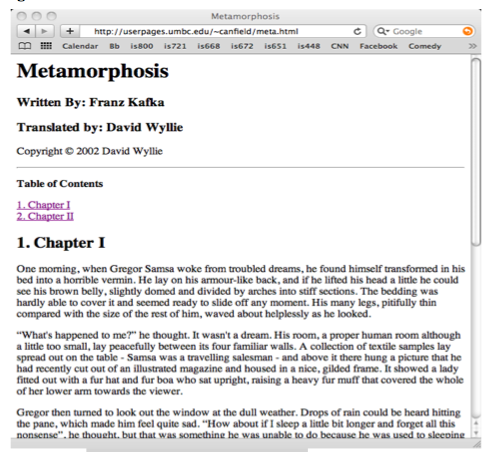

## Chapter 6 - WS-*

### Introduction

The three protocols we have covered to this point are sometimes called the first-generation XML web services. SOAP is the wire protocol and WSDL documents the service. They are also functional protocols in that they are immediately concerned with basic communication of messages.
UDDI can act as a registry and can be considered the first non-functional standard. Complex information systems, however, require many more non-functional services that support the functional ones.
These include things like workflow, management, security, reliability, transactions, and quality of service (QoS). A great number of web service specifications have arisen to offer these kinds of services. They are so numerous, in fact, that the cover term for them is WS-\*, were the star is a wildcard that means all of them! These are the second-generation services. We will briefly cover the most important of these specifications in this chapter, learn a new XML vocabulary for syndication feeds called really simple syndication (RSS), and finally take a look at server-side XSLT processing.

We have covered enough of the web services specifications to build up a labeled web services stack as in figure 6.1.

We will briefly cover the WS-\* specifications in the non-shaded cells (non-functional) in figure 6.1. All of these specifications typically add tags to the SOAP header. WS-Addressing added a crucial missing element to the SOAP header - the address! Oddly enough, the original SOAP specification had no destination address in the document. Only the transport protocol such as HTTP contained that information and that could cause a problem once the SOAP message was stripped from the HTTP entity body, especially since SOAP is supposed to be transport protocol neutral. **WS-Addressing** added the source and destination addresses and details about routing the message between intermediaries. Figure 6.2 shows a simple modification of the stock price SOAP example from w3schools. Notice that I have added a SOAP header which was missing in the original example and used two simple tags defined in the WS-Addressing namespace (there are many more available in the specification at: http://www.w3.org/Submission/ws-addressing/).

Figure 6.1. The web services stack.

Also notice that the address in the HTTP header is also in the SOAP header.

**WS-ReliableMessaging** (WS-RM) is a specification for reliable message delivery (there is also a competing specification called WS-
Reliability). This includes acknowledgment of delivery, sequencing of messages, and prioritization of messages. This specification is maintained at The organization for the advancement of structured information standards (OASIS), which is the other web standards organization besides the W3C.

Figure 6.2. WS-Addressing.

**WS-Security** from OASIS is an important standard for encrypting portions of the SOAP message. The details of encryption are beyond the scope of this course and you should be sure and take a security course to learn encryption before you graduate! It contains two specifications:

-   XML Signature
-   XML Encryption

XML Signature is used to sign data in any XML document, SOAP in this case. Encryption technology includes the concept of a digital signature.
This means that the data is encrypted using public key encryption such that the data is not secret, but is guaranteed to be from the indicated sender and not to have been tampered with (message integrity). XML Encryption is a similar technology, but also makes the data secret.
Different parts of the SOAP message can be encrypted with either or both of these methods and so the all the participants will be able to see only the parts of the message that they are authorized to see and be assured of message integrity.

There are many more WS-* specifications such as:

-   WS-Atomic Transaction
-   WS-Coordination
-   WS-Eventing
-   WS-Metadata Exchange
-   WS-Notification
-   WS-Policy Framework

They all offer various non-functional services for a SOA implemented with XML web services. The enterprise service bus (ESB) is a software infrastructure that is offered by many vendors as a place to deploy WS-* services. It acts as a lightweight, standard backbone for those WS-* services. It standardizes the environment so that all those services can work together. All messages would pass through the ESB and the services can be applied. For example, with java-based web service frameworks like J2EE, there is a standard integration platform called the Java business integration (JBI) which forms their ESB implementation. All ESBs offer a distributed but centrally administered service. That means that the ESB middleware software is on each node that participates in the system.

Two important WS-\* specifications for workflow process management are **WS-BPEL** (business process execution language) and **WS-CDL** (choreography definition language). Both specifications concern modeling business process or workflows and are maintained at OASIS. A workflow is a set of activities, which is stored as a model and they depict a process. A group of activities depict a complete workflow. A workflow can be run by the workflow runtime engine. Workflows are typically presented as data flow diagrams where the activities are tasks as in the very simple in figure 6.3.

Figure 6.3. A workflow diagram.

This kind of workflow can be modeled in XML and this is what WS- BPEL and WS-CDL do. WS-BPEL models workflows within an organization (inside the firewall and called an orchestration language) and WS-CDL models workflows between organizations (outside the firewall and called a choreography language). The XML languages are for representation,
modeling, and interface definition. They are not for running programs and so the run-time engine implementation is in either J2EE, .NET, or some other programming language framework. These implementations would read the XML documents from the workflow web service specifications and implement the processing required by the modeled business process.

An example of a simple WS-BPEL document is given in figures 6.4 and 5.
The XML BPEL document to support the simple hello world process from figure 6.4 is given in listing 6.1. The goal of this example is not for you to memorize all the tags associated with WS-BPEL, but to see how the XML naturally models the workflow. The partner links and process variables are defined in tag blocks. Also note that the sequence tag in listing 6.1 encapsulates the simple step-wise process of the receive,
assign, and reply tasks. As we know, WSDL documents describe the interface of these processes that will be presented to the outside world.

Figure 6.4. The hello world process workflow.

    <process
        name="HelloWorld"
        targetNamespace="http://jbpm.org/examples/hello"
        xmlns:tns="http://jbpm.org/examples/hello"
        xmlns:bpel="http://schemas.xmlsoap.org/ws/2003/03/business-process/"
        xmlns="http://schemas.xmlsoap.org/ws/2003/03/business-process/"> 
        <partnerLinks>
        <!-- establishes the relationship with the caller agent --> 
            <partnerLink
                name="caller"
                partnerLinkType="tns:Greeter-Caller"
                myRole="Greeter" /> 
        </partnerLinks>
        <variables>
        <!-- holds the incoming message -->
            <variable
                name="request"
                messageType="tns:nameMessage" />
            <!-- holds the outgoing message -->
            <variable
                name="response"
                messageType="tns:greetingMessage" />
            </variables>
        <sequence name="MainSeq">
            <receive name="ReceiveName"
                operation="sayHello"
                partnerLink="caller"
                portType="tns:Greeter"
                variable="request"
                createInstance="yes" />
                <!-- receive the name of a person -->
            <assign name="ComposeGreeting">
            <!-- compose a greeting phrase -->
                <copy>
                    <from expression=
                        "concat('Hello',bpel:getVariableData('request','name'), '!')" />
                    <to
                        variable="response"
                        part="greeting" /> 
                </copy>
            </assign>
            <reply
                name="SendGreeting"
                operation="sayHello"
                partnerLink="caller"
                portType="tns:Greeter"
                variable="response" /> 
            <!-- send greeting back to caller -->
        </sequence>
    </process>

Lisitng 6.1. The BPEL document.

For example, the abstract interface presented to callers is defined in the associated WSDL as a portType:

    <portType name="Greeter">
        <operation name="sayHello">
             <input message="tns:nameMessage" />
             <output message="tns:greetingMessage" />
        </operation>
    </portType>

Listing 6.2. portType.

WS-CDL is similar, but with extra tags that are concerned with the between organization processes.

### RSS

We now turn to a different family of XML vocabularies under the heading of really simple syndication as RSS is most commonly known. It has also been known as rich site summary and RDF site summary. You are probably familiar with RSS as a news feed that is associated with blogs. Each blog entry is an item in the XML of RSS and makes it easy to download all the blog entries in one file. RSS is generally useful, however, in information systems. For example, in the BPEL runtime, we could use an RSS feed to monitor the activity of status messages in the workflow. In fact, RSS can be considered an early web service since a web request results in the return of an XML file rather than a web page. It will really be what we will call a REST web service in chapter 7. There are multiple versions, however, and RSS has a rather complicated history.

All RSS is XML with various schemas depending on version. The major versions are in two branches outlined below.

+ RDF Branch 
    -   RSS 0.9 was the original Netscape version in 1999.
    -   RSS 1.0 is based on the resource description framework (RDF) - a more complicated XML vocabulary for graph data structures (2000).
    -   RSS 1.1 is the current RDF version.

+ RSS Branch 
    -   RSS 0.91 was a simplified version of the original 0.9 version that removed the dependence on RDF (2000).
    -   RSS 0.92-94 extensions of version .091 (2001-2).
    -   RSS 2.0 is the current and major version for this branch (2003). For example CNN, the New York Times, and many other sites have adopted RSS 2.0.
    -   Atom 1.0 is a competing feed standard that separated from RSS 2.0 in     2005. Its developers were dissatisfied with the backward     compatibility requirement for RSS and the lack of innovation that     results. Google has adopted Atom.

The major difference between the branches is RDF. The RSS branch removed that for simplicity of adoption for web sites. Both RSS 2.0 and Atom are widely used today. We will look at this branch in this chapter and look at RDF in more detail in chapter 12. RDF is the foundation of the semantic web.

A sample of RSS 2.0 is given in listing 6.3. You can see that it is designed for structured information about web sites. RSS has a structure of modules for extensibility. Modules use namespaces to add names and concepts to RSS for specific application areas. Atom has a similar structure.

    < ?xml version="1.0" encoding="UTF-8" ?>
    <rss version="2.0">
    <channel>
        <title>RSS Title</title>
        <description>This is an example of an RSS feed</description>
        <link>http://www.someexamplerssdomain.com/main.html</link>
        <lastBuildDate>Mon, 06 Sep 2010 00:01:00 +0000 </lastBuildDate>
        <pubDate>Mon, 06 Sep 2009 16:45:00 +0000 </pubDate>
        <item>
            <title>Example entry</title>
            <description>
                Here is some text containing an interesting description.
            </description>
            <link>http://en.wikipedia.org/wiki/RSS/</link>
            <guid>unique string per item</guid>
            <pubDate>Mon, 06 Sep 2009 16:45:00 +0000 </pubDate>
        </item>
    </channel>
    </rss>

Listing 6.3. RSS 2.0.

### Server-side XSLT

We saw client-side XSLT in chapter 5, but most XSLT processing is done on the server. Most programming languages have extensive libraries for dealing with XML, including XSLT processing. We will look at SAXON (http://saxon.sourceforge.net/), which is a java-based XSLT processor.

In this case, any XSLT processing would be done on the server before anything was returned to a user on the web or to another computer program. So in the examples we used in chapter 5, you would only see HTML code returned to the browser, and not see the XML at all when you view the source. This works out well, since as a developer, you would not want to be dependent of the browser version and configuration of arbitrary users.

In chapter 5, we wrote XSLT stylesheets to match our XML code that we had previously written. A more common scenario is to generate XML documents using a standard XMLSchema and then be able to reuse already written XSLT stylesheet libraries for that schema. So you do not have to write the XSLT at all, simply validate your XML against a standard schema.

An example standard schema is DocBook (http://www.docbook.org/) which is a large and robust schema designed for creation of XML documentation of all kinds - books, papers, manuals, etc. So if we have those kinds of materials and we wish to create on-line publications, we can use this schema to markup our text and then easily use the XSLT library for them.
Many computer documentation projects use DocBook. DocBook publishes its schema in DTD and RELAX NG formats. Recall that RELAX NG is a modern alternative to XMLSchema. Figure 6.5 shows a snippet of XML and RELAX NG to give you the flavor of the difference and simplicity of RELAX NG, but it is not essential for understanding DocBook. All schema languages have the same purpose.

Each tag is defined in the schema for DocBook and there are many more tags than you see here. The DocBook book (!) is available on-line at http://www.docbook.org/tdg5/en/html/docbook.html. See chapter 2 of that book for instructions on how to mark up text to follow the DocBook schema. After using the standard DocBook XSLT stylesheets, on the XML in listing 6.4, we get the web page in figure 6.6. We will do this same kind of exercise in the end of chapter exercises.

Figure 6.5. RELAX NG.

Figure 6.6. HTML from the DocBook XSLT.

    < ?xml version="1.0" encoding="utf-8"?>
    <!DOCTYPE book PUBLIC "-//OASIS//DTD DocBook XML V4.1//EN"
    "http://www.oasis-open.org/docbook/xml/4.1/docbookx.dtd">
    <book xmlns='http://docbook.org/ns/docbook'>
        <title>Metamorphosis</title> 
        <bookinfo>
             <title>Metamorphosis</title> 
             <authorgroup>
                <author>
                     <firstname>Written By: Franz</firstname>
                     <surname>Kafka</surname> 
                </author>
                <author>
                    <firstname>Translated by: </firstname> 
                    <surname>David Wyllie</surname>
                </author>
             </authorgroup>
             <edition>August 16, 2005 [EBook #5200]</edition>
             <copyright>
                 <year>2002</year> 
                 <holder>David Wyllie</holder>
             </copyright> 
        </bookinfo>
        <chapter id="I">
             <title>Chapter I</title>
             <para>One morning, when Gregor Samsa woke ... </para>
             <para>
                <quote lang="en">What's happened to me?</quote> he thought ...
             </para>
        </chapter>
        <chapter id="II">
             <title>Chapter II</title>
             <para>It was not until it was getting dark ...</para>
             <para>It was only when he had reached the door ...</para>
        </chapter>
    </book>

Listing 6.4. DocBook XML.

### Chapter 6 Exercises

Do the end-of-chapter exercises for each chapter of the book by following the link in the on-line syllabus.
