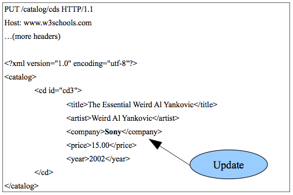
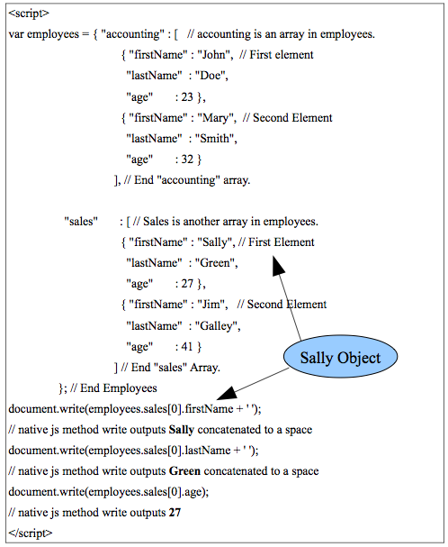
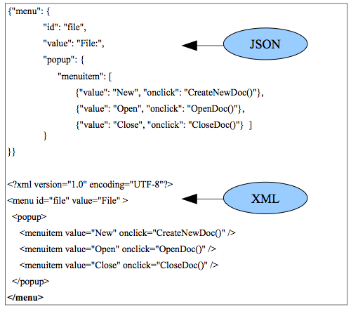
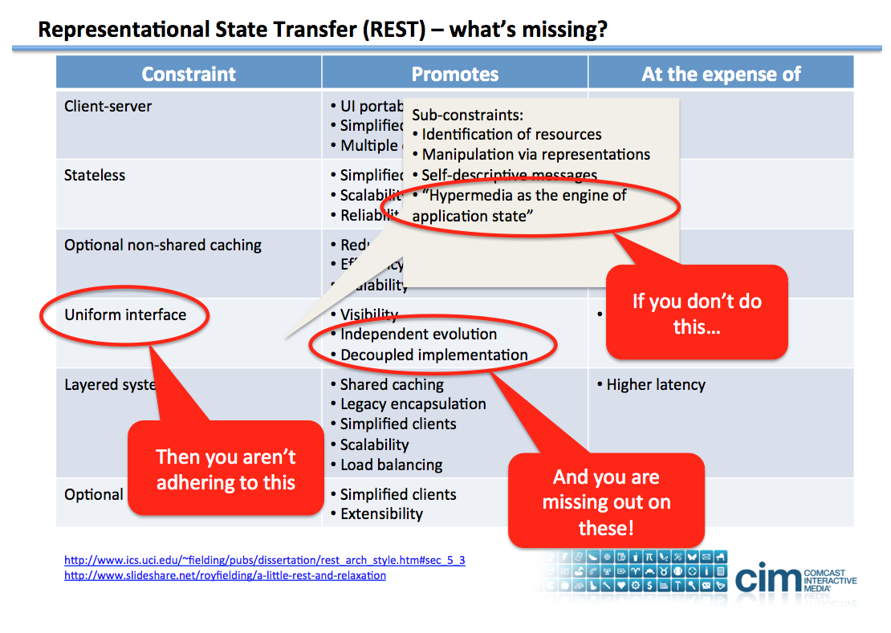
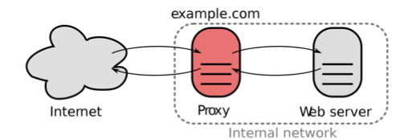

## Chapter 7 - REST Web Services

### Introduction

REST stands for representational state transfer and is an architectural principle rather than a specific technology or standard. It was introduced in a doctoral dissertation by Roy Fielding in 2000 (see the on-line syllabus for references). The REST-style architecture is just like the web. There are requests and responses that are the transfer of resources. Resources are any addressable object (as in something with a URI on the web). HTTP follows these principles summarized here:

-   Client/server interaction
-   Uniform interface
-   Stateless (no context stored between requests)
-   Cacheable (we cover caching in chapter 8)
-   Layered (intermediaries exist that are transparent to clients)

A criticism of SOAP-based web services is that they are overly complicated and work in a really different way than the web even though they use it as infrastructure. For example, new vocabularies can be created at will using XMLSchema so there is no uniform interface.
Similarly, there is no obligation for SOAP-based web services to support loosely-coupled statelessness or be cacheable, although general SOA principles would like those to be true. Stateless server-side components are less complicated to design, write, and distribute across load-balanced servers. A stateless service not only performs better, it shifts most of the responsibility of maintaining state to the client application. There are, in fact, many situations where the complexity of WS-\* is needed, but the vast majority of scenarios do not require it.
So REST web services are a better choice in those cases. In fact, the majority of web application APIs are RESTful as we will see below.

A RESTful web service is implemented with HTTP and has the following specific requirements:

-   All resources are identified by URIs.
-   Only the HTTP methods are used as interface (POST, GET, PUT,
    DELETE).
-   Resources have an internet type (XML, JSON, etc.).

All resources are identified by URIs. This is the way that the web already works. RESTful web services extend this idea to give everything a URL-based resource identifier - not just web pages. Consider the cd examples we saw on w3schools. The basic XML file there is a catalog of music cds (see w3schools XML). We can improve that catalog by giving IDs to all items as in listing 7.1. XML requires that all IDs are unique within a document.

    < ?xml version="1.0" encoding="utf-8"?> 
    <catalog>
        <cd id="cd1">
             <title>Empire Burlesque</title>
             <artist>Bob Dylan</artist> 
             <company>Columbia</company> 
             <price>10.90</price> 
             <year>1985</year>
        </cd>
        <cd id="cd2">
             <title>Hide your heart</title>
             <artist>Bonnie Tyler</artist> 
             <company>CBS Records</company> 
             <price>9.90</price> 
             <year>1988</year>
        </cd>
        ...

Listing 7.1. The cd catalog with IDs.

We can then create URLs to get the entire cd catalog or an individual cd. For example, we could use the URL:

`http://www.w3schools.com/catalog/cds`

to get the entire catalog (the entire XML document of listing 7.1) and:

`http://www.w3schools.com/catalog/cds/2`

to get the Bonnie Tyler cd (just that `id="cd2"` XML subtree in listing 7.1).
All the resources associated with the catalog can be identified with URLs. In reality, of course, some program is going to have to do things like find the cd with a specific id. If we used a CGI program or PHP to do that, we would need a URL something like:
http://www.w3schools.com/getCD.php?cd=2 (not a real url). The getCD program searches the file or database for the id=2 and returns the result to the requestor in XML format. RESTful APIs like to use the better looking URLs such as those in the boxes above. Most web frameworks such as the one we will discuss in chapter 9 have routing capabilities that allow a requestor to submit the good-looking URLs and they are mapped correctly to programs as the uglier URLs make explicit. These good- looking URLs expose an easily understood, directory structure-like path to represent a resource.

Only HTTP methods are used as a uniform interface. POST should be used for creating resources. For example, to create a new entry in the cd catalog, we would use listing 7.2. (There would usually be some way to auto-increment the id instead of explicitly including it as here.)

    POST /catalog/cds HTTP/1.1 
    Host: www.w3schools.com 
    ...(more headers)

    < ?xml version="1.0" encoding="utf-8"?> 
    <catalog>
        <cd id="cd3">
            <title>The Essential Weird Al Yankovic</title> 
            <artist>Weird Al Yankovic</artist> 
            <company>Columbia</company> 
            <price>15.00</price>
            <year>2002</year>
        </cd> 
    </catalog>

Listing 7.2. POST.

A developer could use standard web technology to do the non-RESTful implementation. For example:

`GET /addCD.php?id=cd3`

This would work just fine, but would not be RESTful because resources should only be created with POST according to the uniform interface.

The GET method is only for data retrieval only. GET should be free of side effects (called the idempotence property). It would be used to get information from our cd catalog as the following example which would return the Weird Al cd information:

`GET /catalog/cds/3`

The PUT method should update a cd in the catalog. Figure 7.1 shows this example. Note that the company tag was updated to Sony from Columbia.
Again, a developer could call a program explicitly and do the update with GET, but that would not be RESTful. The DELETE method is used to destroy resources.

Figure 7.1. PUT.

XML is commonly used by REST web services, but it is not required. Any web format is acceptable. A common format used by RESTful APIs is javascript object notation (JSON). This format is equivalent to XML,
less verbose, and it integrates transparently with the javascript language. Basically, the angle brackets of XML are replaced by more economical curly braces and commas. If a javascript program imports JSON, the objects are created automatically by the javascript interpreter and so no XML parsing is needed. Figure 7.3 shows JSON and the equivalent XML. We will also see JSON used in the end of chapter exercises.

A simple example of JSON in figure 7.2 shows how JSON works in javascript. The JSON is included directly in the program here, but could easily be the result of a REST query. It results in the simple text output to the browser:

`Sally Green 27`

with no XML parsing required. The dot notation for objects is used to access the objects from the JSON.

Figure 7.2. JSON (Recall that arrays begin with index 0).

Figure 7.3. JSON vs. XML.

REST APIs are very popular for public web services for web applications.  Twitter, Flickr, YAHOO, Facebook, THe New York Times, NPR, and most other popular destinations on the web offer RESTful APIs for developers to interact with their applications. Let's look at a detailed example using the UK [Guardian newspaper](http://www.theguardian.com/us) and see more examples in the end of chapter exercises.

The Guardian API is called Open Platform and requires that you get a free api key as explained in the slides.  We will use this api to illustrate REST API basics here and in the homework.

The Guardian REST API is documented here (read 'What is the Open Platform?' there):

-   http://open-platform.theguardian.com/

That documentation describes how to construct a URL for the REST API. See the Services/Content API/Reference Guides/Search link for the [specific docs for the search endpoint](http://www.theguardian.com/open-platform/content-api-content-search-reference-guide?guni=Keyword:news-grid%20main-3%20Trailblock:Pickable%20with%20editable%20override:Position1:sublinks&guni=Keyword:news-grid%20main-3%20Trailblock:Pickable%20with%20editable%20override:Position1:sublinks).

Note the following about the XML result in listing 7.3:

-   The result is JSON and not a web page. So it is not intended for  regular web users, but for developers who make these requests in their programs and those programs process the JSON result for display to the users.
-   One could add <em>&format=XML</em> for xml output. This is contrary to the docs (!) that say that XML is default, but actually JSON is default as it is for almost all REST APIs. 
- Try a few more requests using the docs.

One problem that comes up is that web browsers have a security limitation that requires any program running in the browser (using javascript with ajax) can only return results from the same domain that the original web page came from. This is called the <em>cross-domain restriction</em> or the <em>same-origin policy</em>.  This restriction permits scripts running on pages originating from the same site to access each other's methods and properties with no restrictions, but prevents access to pages on different sites. This policy also applies to XMLHttpRequest (ajax).  Our Guardian example would therefore not work for a web page we created on gl since our web page is from umbc.edu and Guardian is on theguardian.com.  There are actually ways to get around this such as [jsonp](https://www.w3schools.com/js/js_json_jsonp.asp) or [cors](http://www.html5rocks.com/en/tutorials/cors/), but this is beyond the scope of this class.

We will use a server-side PHP program (which has no such cross-domain security restriction) to retrieve the JSON or XML from Guardian and then send it back to the user that requested the web page from gl. We will use PHP to issue the request using the Curl library. The Curl library offers a way to send a URL programmatically and handle the response. See listing 7.4. The structure of the PHP program is simple:

-   The $request variable holds our REST request URL.
-   All the curl lines are just boilerplate from the curl library. You only have to set the $request variable in the block as the third parameter (line 4) of setopt function and the remainder is the same unless you want to modify something such as the HTTP method - see: http://us2.php.net/curl.
-   The $xml variable gets the result which will be the response from the REST web service (XML in this case).
-   The echo command prints out the XML to the browser. No parsing was done here and just the raw XML is shown. In a real application, this would not happen. We could have done this by entering the guardian URL directly in the browser! We will improve this next by processing the return on the client-side.

        {
          "response":{
                "status":"ok",
                "userTier":"free",
                "total":23,
                "startIndex":1,
                "pageSize":10,
                "currentPage":1,
                "pages":3,
                "orderBy":"newest",
                "results":[{
                  "id":"news/2013/oct/03/the-best-pictures-of-the-day",
                  "sectionId":"news",
                  "sectionName":"News",
                  "webPublicationDate":"2013-10-03T20:57:36Z",
                  "webTitle":"The best pictures of the day",
                  "webUrl":"http://www.theguardian.com/news/2013/oct/03/the-best-pictures-of-the-day",
                  "apiUrl":"http://content.guardianapis.com/news/2013/oct/03/the-best-pictures-of-the-day"
                },{
                  "id":"news/2013/oct/02/the-best-pictures-of-the-day",
                  "sectionId":"news",
                  "sectionName":"News",
                  "webPublicationDate":"2013-10-02T21:43:38Z",
                  "webTitle":"The best pictures of the day",
                  "webUrl":"http://www.theguardian.com/news/2013/oct/02/the-best-pictures-of-the-day",
                  "apiUrl":"http://content.guardianapis.com/news/2013/oct/02/the-best-pictures-of-the-day"
                },{
                  "id":"news/2013/oct/01/the-guardians-photo-team...-today",
                  "sectionId":"news",
                  "sectionName":"News",
                  "webPublicationDate":"2013-10-01T22:51:04Z",
                  "webTitle":"The best pictures of the day",
                  "webUrl":"http://www.theguardian.com/news/2013/oct/01/the-guardians-photo...-today",
                  "apiUrl":"http://content.guardianapis.com/news/2013/oct/01/the-guardians-photo...-today"
                },{ ...
                }]
            }
        }

Listing 7.3. The result of the Guardian request.

The curl command actually works on the command line. Try the following at the gl prompt. (Don't forget to sign up for a free api key on the Guardian website)

`$>curl 'http://content.guardianapis.com/search?q=syria&section=news&from-date=2013-09-01&format=XML&api-key=YOUR_API_KEY'`

    < ?php
        $request = 'http://content.guardianapis.com/search?q=syria&section=news&from-date=2013-09-01&format=XML&api-key=YOUR_API_KEY';
        $ch = curl_init(); // initialize curl handle
        (http://us2.php.net/curl)
        curl_setopt($ch, CURLOPT_URL, $request); // set url - must match above
        curl_setopt($ch, CURLOPT_FAILONERROR, 1);
        curl_setopt($ch, CURLOPT_FOLLOWLOCATION, 1);// allow redirects
        curl_setopt($ch, CURLOPT_RETURNTRANSFER,1); // return into a
        variable
        curl_setopt($ch, CURLOPT_TIMEOUT, 3); // times out after 4s
        curl_setopt($ch, CURLOPT_HTTPGET, 1); // set GET method
        // run whole process and put the response from the service into the $xml variable
        $xml = curl_exec($ch); 
        curl_close($ch);
        header("Content-type: text/xml"); //send http header for xml with MIME type 
        echo($xml); //send the xml to the browser
    ?>

Listing 7.4. Curl.

Now, let's see how we can use this with ajax to create a simple application that uses the Guardian REST web service. We will use the JQuery library we saw in chapter 3 to issue the request for JSON and process the result for the user. Listing 7.5 shows the javascript code that uses JQuery.
Note the following about the code:

-   The script tag code will write to the empty div tag in the HTML.
-   The getJSON function is a convenience one from JQuery that lets us write an easy ajax call.
-   The first getJSON parameter is the program we call with ajax. It is in the same domain as the web page so it works! It is the one from figure 7.4, guardian.php except that we want JSON instead of XML.
-   The next parameter is the ajax callback. It gets the information from the returned JSON and uses the dot notation to place it in the javascript code. No parsing required!
-   For example, the callback outputs all the JSON in a variable called data, so we can access any part of it with that variable like <em>data.response.userTier</em> which would be `free`.
-   This example is available at: guardian.html.
-   Try the REST call with PHP by itself: guardian.php and this will allow you to see the JSON that JQuery is processing.
-   JQuery creates the HTML tags with the <em>$</em> function and appends them to the div tag with #guardian (# means id).

This completes our treatment of REST although we will look at another API in the end of chapter exercises. We have seen:

-   What REST web services are and how they differ from SOAP- based web services. REST assumes a point-to-point communication model which is not usable for a distributed computing environment where messages may go through one or more intermediaries. Those are more complex situations where SOAP-based web services are a better fit.
-   What a REST API is for a web service.
-   How to use the documentation of a REST web service to construct a URL using the API.
-   How to use JSON and XML as the return format.
-   How to create a web browser-based application that uses a REST web service.

        <!DOCTYPE html>
        <html>
        
            <head>
                
            </head>
            <body>
                <!--this is an empty div that the script below will write to--> 
                

                 
            </body>
        </html>

Listing 7.5. Guardian call from ajax using jquery.

### Hypermedia APIs

Most REST APIs are as described above. An example is the Flickr API that we use in the exercies. They miss a crucial requirement associated with uniform interface listed in the Fielding dissertation, however. See Figure 7.4. We will use an external video lecture and a couple of readings on the reference page to see how the recent proposals for Hypermedia APIs are a little different than typical REST APIs. Be sure and know these terms and concepts:

-   Coupling issues for a service
-   HATEOS
-   Self-describing API

Figure 7.4. Hypermedia APIs

### RSS

We now turn to a different family of XML vocabularies under the heading of really simple syndication as RSS is most commonly known. It has also been known as rich site summary and RDF site summary. You are probably familiar with RSS as a news feed that is associated with blogs. Each blog entry is an item in the XML of RSS and makes it easy to download all the blog entries in one file. RSS is generally useful, however, in information systems. For example, in the BPEL runtime, we could use an RSS feed to monitor the activity of status messages in the workflow. In fact, RSS can be considered an early web service since a web request results in the return of an XML file rather than a web page. It was really the first REST web service (long before they called it that). There are multiple versions, however, and RSS has a rather complicated history.

All RSS is XML with various schemas depending on version. The major versions are in two branches outlined below.

+ RDF Branch 
    -   RSS 0.9 was the original Netscape version in 1999.
    -   RSS 1.0 is based on the resource description framework (RDF) - a more complicated XML vocabulary for graph data structures (2000).
    -   RSS 1.1 is the current RDF version.

+ RSS Branch 
    -   RSS 0.91 was a simplified version of the original 0.9 version that removed the dependence on RDF (2000).
    -   RSS 0.92-94 extensions of version .091 (2001-2).
    -   RSS 2.0 is the current and major version for this branch (2003). For example CNN, the New York Times, and many other sites have adopted RSS 2.0.
    -   Atom 1.0 is a competing feed standard that separated from RSS 2.0 in     2005. Its developers were dissatisfied with the backward     compatibility requirement for RSS and the lack of innovation that     results. Google has adopted Atom.

The major difference between the branches is RDF. The RSS branch removed that for simplicity of adoption for web sites. Both RSS 2.0 and Atom are widely used today. We will look at this branch in this chapter and look at RDF in more detail in chapter 12. RDF is the foundation of the semantic web.

A sample of RSS 2.0 is given in listing 6.3. You can see that it is designed for structured information about web sites. RSS has a structure of modules for extensibility. Modules use namespaces to add names and concepts to RSS for specific application areas. Atom has a similar structure.

    < ?xml version="1.0" encoding="UTF-8" ?>
    <rss version="2.0">
    <channel>
        <title>RSS Title</title>
        <description>This is an example of an RSS feed</description>
        <link>http://www.someexamplerssdomain.com/main.html</link>
        <lastBuildDate>Mon, 06 Sep 2010 00:01:00 +0000 </lastBuildDate>
        <pubDate>Mon, 06 Sep 2009 16:45:00 +0000 </pubDate>
        <item>
            <title>Example entry</title>
            <description>
                Here is some text containing an interesting description.
            </description>
            <link>http://en.wikipedia.org/wiki/RSS/</link>
            <guid>unique string per item</guid>
            <pubDate>Mon, 06 Sep 2009 16:45:00 +0000 </pubDate>
        </item>
    </channel>
    </rss>

Listing 6.3. RSS 2.0.

We will now take a look at an XML vocabulary for graphics.

### SVG

SVG is an XML vocabulary for describing 2-dimensional vector graphics.
It is a W3C specification that began in 1999. The current version is SVG 1.1. Vector graphics is the use of geometrical primitives such as points, lines, curves, and shapes or polygon(s), which are all based on mathematical equations, to represent images in computer graphics. So vector graphics can be resized to different resolutions (the scalable part) without resampling or image degradation. Raster graphics on the other hand, represents images as an array of pixels (a bitmap) and have a fixed resolution that can only be changed by resampling algorithms than add or subtract from the image resulting in degradation. Png, gif and jpg are all examples of raster graphics.

We will use the on-line w3schools tutorial for SVG. Our main goal here is just to see a novel implementation of another XML vocabulary. Since it is a specification that began in 1999, it is a vocabulary defined from a DTD. They have not changed that to XMLSchema in recent versions,
but have added a namespace: http://www.w3.org/2000/svg. Read the short tutorial and play around with the tutorial examples of SVG using the `Try it yourself >>` tool. Note that several of the images in this book are SVG. Figure 8.3,
for example began as an SVG file (repeated here as figure 9.4).

Figure 9.4. Reverse proxy cache (SVG file). 

Go to http://en.wikipedia.org/wiki/Proxy_server and find the freely licensed image. Click on the image and see that it is from the file:
Reverse_proxy_h2g2bob.svg. Click on the file link and view the source of the file. It is a complicated file and it is not necessary to understand it all. Notice, however, that it does not use the DOCTYPE,
but does use namespaces. This is actually the recommendation of the W3C - to not use the DOCTYPE and DTD, but to use namespaces (w3schools does not seem to have gotten the message!). This is a peculiarity of the fact that SVG was originally created long ago as an application of XML using a DTD, but DTDs do not handle namespaces. Note that there is a namespace for Inkscape. This is an open-source application for creating and editing SVG files.

Google has recently started indexing all SVG on the web and so now you can do custom searches for SVG. Go to google and do an image search on proxy server. Click on advanced search and choose the SVG filetype. You should see the image in figure 9.4 in the results.

Adobe Flash is currently the most widely used vector graphics and animation format on the web, but it is in a proprietary, binary format that makes interoperability problematic. SVG mixes easily with web services since it is XML. One can send SVG diagrams or animations via SOAP or REST messages. HTML5 supports SVG and its own Canvas drawing technology and many think this will replace Flash. SVG is better for high resolution and Canvas is better for fast animation.

