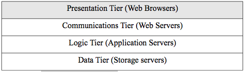
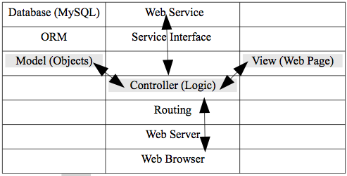
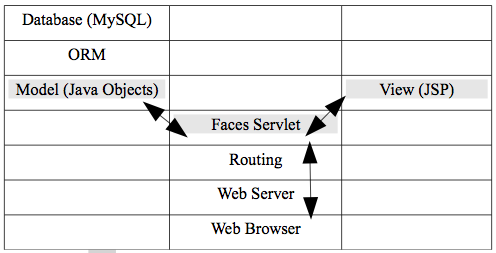

 

## Chapter 9 - Microservices
### Introduction

We will use this [introduction to microservices](https://www.nginx.com/blog/introduction-to-microservices) from [nginx](https://www.nginx.com/), section 1 only (cached pdf [here](../Microservices_Designing_Deploying.pdf)). We will revisit microservices and read additional sections in chapter 12.  In order for us to really understand the distinction between monoliths and microservices, we will examine a popular design pattern used in web frameworks.

### Web Frameworks

Almost all new development for distributed systems today is based around the web infrastructure of using HTTP to access web resources and web services. Creating presentation tier clients with web-based programming frameworks for this infrastructure helps the architects and developers to effectively and quickly build, test, and deploy these applications.
We will survey web-based frameworks in this chapter for major implementation technologies and do some programming exercises to make the discussion more concrete.

The four tier web infrastructure is shown in figure 9.1 with the logical presentation tier highlighted as where these web-based frameworks are focused at delivering web applications. The frameworks involve all layers, however, in that the frameworks use javascript in the web browser, web servers to deliver content, application server technology such as PHP for server-side processing, and databases for maintaining state.

Figure 9.1. The web infrastructure. 

Software frameworks are generic, partially written applications for a specific application architecture that make creating new applications quicker and easier. The frameworks offer a large collection of libraries that take care of all the routine programming tasks and leave the programmer to implement the custom functions that are required for the new application. This makes programmers much more productive, but removes flexibility. So as long as the needed application follows the patterns given by the framework, it works well. If a new pattern is needed, the programmer might well be better advised to program from scratch. Web-based applications are well suited to a collection of design patterns that are implemented in web frameworks. Most web frameworks have integrated development environments (IDEs) that are used to easily access the web framework libraries while programming.

Design patterns are an influential concept in software engineering that represent reusable solutions to a commonly occurring programming and software design problems. It is not code but a description of the pattern. Programmers use code to implement the design pattern. Web frameworks are code that implement proven, relevant design patterns.

Design patterns gained popularity in computer science after the book Design Patterns: Elements of Reusable Object-Oriented Software was published in 1994 by the so-called "Gang of Four" (Gamma et al.). A very common design pattern used in web frameworks is the model, view,
controller (MVC) pattern which separates interface, logic, and data models so that code developed with this pattern is more easily maintained, tested, and developed. Figure 9.2 shows the basic MVC pattern.

The general operation of MVC can be described as follows. A web browser makes a request to a web server with a nice looking URL as we defined them earlier for REST web services. The routing layer associated with the web framework translates the nice URL structure to call the specific web applications offered by the controller. The controller gets data from the model for processing. The model is responsible for getting data from the database and creating objects because web frameworks are typically implemented in object-oriented languages and cannot directly operate on relational databases. The controller program participates in a SOA and so can also request SOAP or REST web services. The controller then instantiates a template view for the results of the data processing. This view is usually a web page that is returned to the web server by the controller and the web server returns it to the requesting client. The view templates usually use technology like PHP (or JSP or ASP) that we covered earlier where programming code can be mixed with HTML in a template.

Figure 9.2. MVC. 

Another design pattern used by web frameworks is object relational mapping (ORM). In the MVC pattern described above we saw that the model must get data from the database. The ORM layer is between the model and the database and creates a virtual object database that can be used from within the object-oriented programming language. It also uses application (object) caching to improve performance.

There are hundreds of web frameworks in many different programming languages. We will survey only a few of them and concentrate on an example using PHP since we studied that previously. We will classify them according to the three major implementation technologies of J2EE (java), .NET (Microsoft), and web scripting environments.

There are many web frameworks that use the java web application server technology. A java web application must run in a servlet container that communicates with a web server via the java servlet API. Servlet containers are also called web containers. Java servlet containers typically run as a process that creates a new thread for every request.
The most recent and commonly used framework for java is java server faces (JSF) which uses the MVC pattern. The structure of JSF is shown in figure 9.3.

Figure 9.3. JSF. 

The faces servlet is the controller that does processing using java objects and instantiates views with Java server pages (JSP) that contain JSF tags. JSF tags are a special tag library that make programming simpler for common web scenarios. There are many IDEs that support JSF.
A common one is NetBeans. Java web application servers can run on almost any operating system.

ASP.NET is an MVC web framework from Microsoft that builds on the .NET component model and uses programming languages such as C#. All the same concepts apply. The web browser requests a page (with a .aspx extension)
and the routing layer converts the URL to an action in the front controller. Since C# is an object-oriented language, there is an ORM layer for the model. Views are created with active server pages (ASP)
that allow code to be mixed with HTML but the code is executed server-side. The ASP.NET framework is highly optimized for Microsoft server environments and makes programmers very productive with the Microsoft Visual Studio IDE, but of course, it can only be used with the Microsoft operating system.

There are many frameworks based on web scripting languages. A few examples are (where the framework name is followed by the programming language in parentheses):

-   Ruby on rails (Ruby)
-   Express (server-side Javascript)
-   Django (Python)
-   CodeIgniter (PHP)

Ruby on rails (ROR) has been very influential and has influenced the design of many other web frameworks that use other scripting languages.
The web frameworks for scripting languages are all MVC, use object-
oriented programming languages and follow the same patterns we have already seen. We will look at the open-source PHP framework TinyMVC (http://www.tinymvc.com/) in detail. It is a very simple (and small) framework inspired by ROR. Read the on-line documentation/tutorials. As with most of these frameworks, we will have to do very little actual programming since the framework does most of the work.

#### TinyMVC

A few details about PHP and the gl environment are needed before you start working with TinyMVC. Firstly, the point of this exercise is not to make you an expert programmer. The point of this exercise and those below are to make the concepts associated with frameworks concrete, just as in chapter 3. It is not necessary to be an experienced programmer to complete these exercises because the code is given to you. Just reading about the concepts, however, does not result in any real understanding.

TinyMVC uses object-oriented PHP. The main thing you need to understand the code given to you is that PHP classes are created and inherit from superclasses using the syntax:

`< ?php class Hello_Controller extends TinyMVC_Controller {...} ?>`

where the class code goes inside the curly braces and TinyMVC_Controller here is the superclass. Recall from your previous programming classes that objects have properties and methods that will be defined here. PHP uses the arrow notation (->) to refer to an object's methods or properties as in:

`$this->view->assign('title','Hello');`

where $this is a built-in variable and refers to the current object -typically from inside a class.

You should read the on-line installation instructions, but I give you customized ones for gl below. The installation basically just requires copying some files. The installation steps customized for gl are:

<ol class="arabic simple">
<li>Unzip the package for TinyMVC. Use the unzip command to unzip the zip file or upload the TinyMVC folders and files to your server. Normally the
<em>index.php</em> file will be at your root, but you will make a subdirectory of 'tinymvc' under swe2016.  Your unzipped directory will look like:
<pre>
TinyMVC-1.2.3
-- htdocs
   -- css
   -- index.php
-- tinymvc
    -- myapp
        -- configs
        -- controllers
        -- models
        -- views
        -- plugins
    -- myfiles
    -- sysfiles
</pre>
So rename the unzipped directory 'TinyMVC-1.2.3' to 'tinymvc', copy the css directory and index.php file to that root, and then delete the 'htdocs' directory as:
<pre>
tinymvc
   -- css
   -- index.php
   -- tinymvc
     -- myapp
        -- configs
        -- controllers
        -- models
        -- views
        -- plugins
     -- myfiles
     -- sysfiles
</pre>
You will also need to make a small change to the 'index.php' file as: 
`if(!defined('TMVC_BASEDIR')) define('TMVC_BASEDIR',dirname(__FILE__) . DS . '..' . DS . 'tinymvc' . DS);` 
to 
`if(!defined('TMVC_BASEDIR')) define('TMVC_BASEDIR',dirname(__FILE__) . DS . '.' . DS . 'tinymvc' . DS);` 
(change two dots to one dot).
 </li>
<li>Since you will use a database, open the
<em>tinymvc/tinymvc/myapp/configs/config_database.php</em> file with a text editor and set your
database settings (see below).</li>
<li>Open the default page. Then do the simple 'hello' tutorial examples in the documentation.</li>
</ol>

You will need to setup your MySQL database. Your gl account has been configured with access to the database already. Use the following steps to set it up:

1.  ssh to your gl account.
2.  type the command: `mysql -u username -p`
where you use your own username. You will be prompted for your password and use your username again. When they first make your accounts, that is the way they configure them - with the username as the password (very insecure so now change your password with the mysqladmin GUI - see below).
3.  You will now see the mysql prompt where you can type mysql commands or SQL commands. 
4.  You can get out of mysql by typing `\q` and you will return to the gl prompt.
5.  Understand the following about the umbc mysql environment:
    -   The host name for the database server is studentdb-maria.gl.umbc.edu (maria is a fork of mysql). You will need to enter this in code in a configuration file for the exercise. Mysql is on a different host than gl.
    -   In mysql, one can normally create any number of databases with any number of tables in each database. This is not true for our student implementation. You only have one database and it has your username as the name. You cannot create additional databases or change the name of the single database. You can create any number of tables within your one database, however. This will work fine for the exercise.
    -   You can create, see, and manipulate database tables with the mysqladmin web-based interface at: http://webadmin.umbc.edu/mysqladmin/. You will be using it to create the database tables for the tutorial. It is actually the same thing as the command-line interface, but with the web-based graphical interface. Be sure to change your password to something secure.

##### TinyMVC CRUD Tutorial

We will build a [simple CRUD application in TinyMVC](https://swe.umbc.edu/~canfield/tinymvc/index.php/grades/roster) to see how it works. You can use the simple grade roster application and update records but cleanup after yourself - delete the records you create. Note:

- I have redundantly saved all the code as .txt so you can see it. You need to find it after you understand how TinyMVC is setup for urls and files from the documentation.  For example, the url above gets to the 'roster' action of 'grades' controller and to see the source, one has to navigate to the [file](https://swe.umbc.edu/~canfield/tinymvc/tinymvc/myapp/controllers/grades.txt).
- This is an example of the `monolith` type of application in the reading because everything is tightly coupled.
- We will go over this in class, but it is very important for you to read the simple code and understand it.  There is nothing here that you cannot understand with what you know now.

#### Silex

We will also install a different style of micro-framework that works well for <em>single-page apps</em> called [silex](http://silex.sensiolabs.org/).  This install also is basically just an unzip of the zipped source.  Read the docs to see how the routing is different than TinyMVC.  You will not be doing much with this framework now except showing the start 'hello' file, but we will use it in chapter 11. You can see it in my gl account here at http://swe.umbc.edu/~canfield/silex/web/index.php/hello/kip. You can get rid of the ugly index.php (front controller or router) using a <em>.htaccess</em> file inside the web directory with this one-line content (but with your username of course):

`FallbackResource /~canfield/silex/web/index.php`

This allows you to use urls such as:

`http://swe.umbc.edu/~canfield/silex/web/hello/kip` 

The front controller is still called each time, but since it is in every url, the .htaccess file inserts it. This allows one to have 'pretty' urls.

### Chapter 9 Exercises

Do the end-of-chapter exercises for each chapter of the book by following the link in the on-line syllabus.
