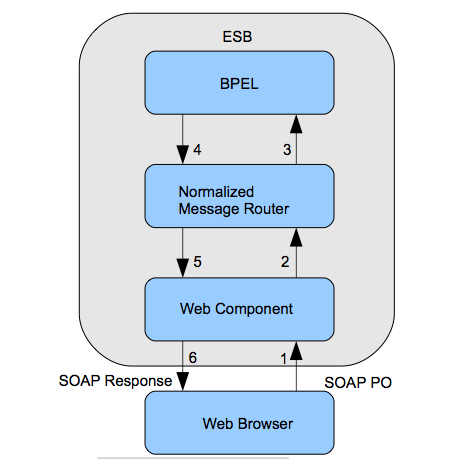
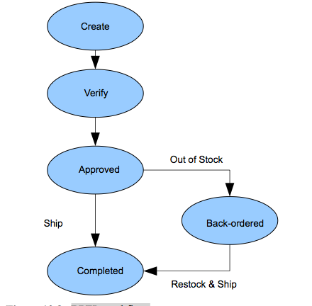

##Chapter 10 - SOAP Revisited

###Introduction

We will implement our own SOAP clients and servers in this chapter. We will use the native PHP5 SOAP library. This exercise will give us more insight into how distributed systems are put together and the focus is not on programming. You will be given the programs and expected to make only very minor modifications. It will require some effort, however, to understand how the programs work and how all the pieces fit together, which is our goal. We will see in greater detail how the technology of XML web services fits with implementation technologies.

SOAs that use SOAP-based web services consist of clients and servers that understand SOAP. The back-end processing for the servers must, of course, be implemented in some programming language within a library-
supported framework that will connect the XML of the XML web services to those programs. We will be doing a simple SOA using PHP as the back-end language and the SOAP library as the connector piece in the architecture.

###Creating a PHP SOAP (Proxy) Client

Listing 10.1 shows a SOAP client for the Shakespeare service we used in chapter 4.

Notes:

1. Here is a <a href="https://swe.umbc.edu/~canfield/soap/samples/shakesclient.php">live view</a> from gl. View the source.
2. We see the request SOAP XML created by this SOAP client in listing 10.2 that is also displayed by the app. One would not display this in real-life - it is just for our edification.
3. This is hard-coded. One has to change the request string in the code to get a different result.

        < ?php
            $requestParams = array(
                'Request' => 'My Kingdom for a horse'
            );

            $client = new SoapClient('http://www.xmlme.com/WSShakespeare.asmx?WSDL', array('trace' => 1));
            $response = $client->GetSpeech($requestParams);

            #print_r($response);
            echo $response->GetSpeechResult;
            echo "
";
            echo "View source to see this xml: ";
            echo $client->__getLastRequest() . "\n";
            echo $client->__getLastResponse() . "\n\n";
        ?>

Listing 10.1. The SOAP shakespeare client.

    < ?xml version="1.0" encoding="UTF-8"?>
    <SOAP-ENV:Envelope 
        xmlns:SOAP-ENV="http://schemas.xmlsoap.org/soap/envelope/" 
        xmlns:ns1="http://xmlme.com/WebServices">
        <SOAP-ENV:Body>
            <ns1:GetSpeech>
                <ns1:Request>My Kingdom for a horse</ns1:Request>
            </ns1:GetSpeech>
        </SOAP-ENV:Body>
    </SOAP-ENV:Envelope>

Listing 10.2. The SOAP request.

We would need this server-side client for an HTML page we created for a user to access this web service. Recall that a request for a service is subject to the same domain rule for web browsers. A web browser cannot request the Shakespeare web service from the xmlme.com domain when the web page comes from the umbc.edu domain, but using the listing 10.1 program as a proxy client, it will work since server-side programs have no such restriction.

Listing 10.3 shows such an HTML page. You can see working links to all these programs in the on-line syllabus for chapter 10.

    <html xmlns="http://www.w3.org/1999/xhtml" xml:lang="en" lang="en">
    <head>
        <meta http-equiv="Content-Type" content="text/html; charset=utf-8"/>
        <title>HTML form for Shakespeare web service</title>
    </head>
    <body>
        <h2>GetSpeech</h2>
        

        GetSpeech requires a string formatted phrase from one of Shakespeare's plays as input. The speech, speaker, and play will be returned as an XML string. Sample Shakespeare Phrases: To be, or not to be | My kingdom for a horse | Get thee to a nunnery | ... 
        

        <h3>HTML Form for Shakespeare Web Service</h3>
        <form action="soap/samples/shakesclient2.php" method="get"><!--1. http GET method -->
            Enter a line: <input type="text" size="40" name="sline" /><!--2. parameter -->
            <input type="submit" />
        </form>
    </body>
    </html>

Listing 10.3. The HTML page that calls the PHP client.

Each program comment is further explained below:

1.  The form action calls our program from listing 10.1 with a slight modification. It uses the HTTP GET method that will put the parameter in an HTTP querystring in the request URL.
2.  The form calls a slightly different version of the client that parses the xml response. See the code at shakesclient2.txt. It works with the original client also.
3.  There is an input tag that allows a user to type in a line from the displayed choices. Since the name of the input tag is sline, the request URL would be:
    
    `https://swe.umbc.edu/~canfield/soap/samples/shakesclient2.php?sline=Get%20thee%20to%20a%20nunnery`
    
(which should be all on one line). The funny characters in the URL for `Get%20thee%20to%20a%20nunnery` are URL encoding. The browser has replaced illegal URL characters such as space and comma with other characters specified in the W3C URL specification.

A slight modification is required to the program in listing 10.1 to make this web application work. Note that in the program, the $request is hard coded. It will only work with that line 'Winter of our discontent'.
We need it to work with any line submitted from the HTML form. So we must replace that line with the $request with:

`$requestParams = array('Request' => $_GET["sline"]);`

This gets the parameter from the HTTP querystring that was created from the line entered in the HTML form. You can review the use of the $_GET function in the PHP tutorial at w3schools. A programming note about PHP is that this array is called an associative array or hash. This means that the indexes of the array are strings rather than integers. PHP uses the hash rocket notation (=>) to associate them. If you needed more than one parameter in the array because the SOAP has more than one, PHP uses a comma separated list of any length as below:

    < ?php
        $arr = array("foo" => "bar", 12 => true); echo $arr["foo"]; // prints bar
        echo $arr[12]; // prints 1 (for true)
    ?>

###Creating a Server in PHP SOAP

The scenario for our case study will be an e-commerce system where wholesalers create SOAP servers to receive POs from retailers and return an invoice. Listing 10.4 shows the SOAP server code. The on-line syllabus has links for working code. Each program comment is further explained below:

1. 

Listing 10.5 shows the cdx.php file with the code for the service. This is a very unrealistic service in the interest of keeping it simple for us to concentrate on the structure of the application.

        < ?php
            class MyService
            {
                public function cdStore($cd,$quant)
                {
                  $price=array('cd1'=>12, 'cd2'=>9, 'cd3'=>11, 'cd4'=>15, 'cd5'=>20);
                    $name=array('cd1'=>'Led Zepplin', 'cd2'=>'Buddy Miller', 'cd3'=>'AC/DC', 'cd4'=>'Neko Case', 'cd5'=>'Motorhead');
                    $stock=array('cd1'=>8, 'cd2'=>10, 'cd3'=>6, 'cd4'=>2, 'cd5'=>4);
                    if ($quant <= $stock[$cd])
                        $result="In Stock - ".$quant." ".$name[$cd]."@$".$price[$cd]." - Price= $" . $quant*$price[$cd];
                    else 
                        $result="Sorry, Out of Stock.";
                    return array('invoice'=>$result);
                }
            }

            $options = array(
                'uri' => 'http://swe.umbc.edu/~canfield/soap/cdsoap/v0/cds',
                'location' => 'http://swe.umbc.edu/~canfield/soap/cdsoap/v0/cdsoapserver.php',
            );

            $server = new SOAPServer(null, $options);
            $server->setObject(new MyService());
            $server->handle();
        ?>

Listing 10.4. SOAP server (cdsoapserver.php).

Note the following about listing 10.4:

-   The catalog is just 3 hard-coded arrays. In real-life, of course, this would come from either a relational or XML database.
-   We are not updating the inventory. So if someone buys something, the inventory numbers are not decremented - very unrealistic.
-   This service simply uses the inputs of the ID of the cd and the needed quantity to check the 'database' and see if there are enough to meet the demand. If so, an 'Invoice' is generated with the total price in dollars. No code lines ending with semi-colons should actually wrap as some do in this book format.

The SOAP client (cdsoapclient.php) to access this web service is given in listing 10.5. It should be familiar from our previous discussion of SOAP clients. Retailers send 2 parameters to the wholesaler's SOAP server - the ID of the cd and the desired quantity.

        < ?php
            $options = array(
                'uri' => 'http://swe.umbc.edu/~canfield/soap/cdsoap/v0/cds',
                'location' => 'http://swe.umbc.edu/~canfield/soap/cdsoap/v0/cdsoapserver.php',
                'trace' => 1
            );
            $client = new SOAPClient(null, $options);
            $cd='cd1'; //hardcoded
            $q=2;
            echo $client->cdstore($cd, $q)['invoice']. " \n"
        ?>

Listing 10.5. The SOAP client for the cdStore service (cdsoapclient.php).

We notice a few undesirable things about the code in listing 10.5:

-   The client parameters are hard-coded. This will not really work since we want to be able to order any of the CDs. We will remedy this in the exercises.
-   In a real B2B situation, we would want to be able to submit an XML PO to the wholesaler instead of just the values for a single cd. We would want to have a whole list of items as we saw in the shiporder PO from chapter 4. In the interests of simplicity, we will discuss this below but not fix it.
-   The output is a dynamic web page that shows the simple invoice information. This is fine for humans, but in real-life, we would want to get back an invoice XML document with a standard XMLSchema for processing on our own information system. We will also discuss, but not fix this issue below.

The HTML string result for the hard-coded cd1 and quantity of 2 is the following. You can <a href="https://swe.umbc.edu/~canfield/soap/cdsoap/v0/cdsoapclient.php">try it</a> from my account.

`In Stock - 2 Led Zepplin@$12 - Price= $24 `

The simple web service in this case study is really adapted to humans with this kind of interface. This is fine for our toy system, as long as we understand the issues.  We will refactor this system in the homework.

Figure 10.1. The purchase order scenario. 

Figure 10.1 shows a more realistic scenario for a purchase order to the cdStore. In many B2B use cases, large retailers would want to have computer programs generate XML POs perhaps from a just-in-time inventory system where the program is monitoring their inventory levels. These XML POs would be sent as document/literal SOAP as we saw in chapter 4. The responses would also be XML where the invoice uses a standard schema that computer programs can work with in the billing and payment system.
Our little system is more of a C2B e-commerce system where a public customer or a small retailer uses a web form to order. In the more complex B2B case, the computer programs would have to parse the XML as a first step for input to the remainder of processing instead of getting all the parameters separately. All web services libraries have powerful functions for XML parsing. We will see XML parsing in the next chapter.
The step numbers for the message flow in figure 10.1 are given below:

1. The client takes the purchase order information and packages it into a SOAP message. The format of the SOAP message is defined using  a WSDL. The client could be a web browser for a human as in the figure or it could be a computer program with no human user. The SOAP message is sent to a web service endpoint using HTTP.
2.  The web component transforms the SOAP message into a normalized  message. The normalized message is sent to the normalized message router. A message router is a service given by the Enterprise Service Bus (ESB). Normalized means that the whitespace in a message has been standardized. Recall that XML retains whitespace as significant. For example, if given  "<customer> John Smith </customer>", after normalization, it would be "<customer>John Smith</customer>" with the extra spaces removed. Normalization is also called canonicalization. The standard     algorithm at the W3C is called C14n (there are 14 letters between C and N).
3.  The normalized message router routes the normalized message to the BPEL service engine.
4.  The BPEL service engine would handle billing, shipping, inventory, etc. using the information in the PO.
5.  The BPEL service engine creates a response message in the form of a normalized message. The normalized message is sent to the normalized message router.
6.  The web component receives the response message and converts it to a SOAP message. The SOAP message is sent back to the client as a proper response as defined by the WSDL.

The ESB offers services that are common to many web serices on the same application server.  Figure 10.2 shows the BPEL workflow. A received PO must be verified against a set of business rules that check purchase amounts, credit and payment history, etc. This verification is done automatically by the cdStore. After verification, the PO either begins the shipping process if in stock or it enters the back-ordered state. When the back-ordered items are received by the supplier, the order ships and the process is complete. Since these steps are largely automated and there are delays,
the messages are sent asynchronously. There is a callback message when a step is completed. You can easily see how such a workflow can be modeled in BPEL XML and implemented in a back-end programming language framework in principle from our previous study.

Listing 10.7 shows the SOAP message for the submission of the PO. It is very similar to the document-style message we saw in chapter 4. The headers for WS-Addressing have been added. The namespace for the PO would be defined with XMLSchema and referenced in the WSDL types section. The WSDL would also define the asynchronous operation in the portType section for the CreatePO operation that you see in the wsa:Action tag in the SOAP.

There would be other operations besides CreatePO defined in a real web service such as GetPOStatus, UpdatePO, and CancelPO and each portType operation would be made up of defined messages. Listing 10.8 shows the SOAP response. Note that there is po:StatusURL tag that offers a RESTful interface to getting a status update on the PO. This could be implemented as an RSS feed as we discussed earlier.

Figure 10.2. BPEL workflow. 

    < ?xml version="1.0" encoding="utf-8"?>
    <soap:Envelope xmlns:soap="http://www.w3.org/2001/12/soap-envelope">
        <soap:Header>
            <wsa:MessageID>889923-1</wsa:MessageID>
            <wsa:To>http://userpages.umbc.edu/~canfield/po_service</wsa:To>
            <wsa:Action>http://userpages.umbc.edu/~canfield/po/CreatePO</wsa:Action>
            <wsa:From>
            <wsa:Address>http://userpages.umbc.edu/~customer</wsa:Address>
            </wsa:From>
        </soap:Header>
        <soap:Body>
            <shiporder
            orderid="889923"
            xmlns:po="http://userpages.umbc.edu/~canfield/po">
                <po:orderperson>John Smith</po:orderperson>
                <po:shipto>
                    <po:name>Ola Nordmann</po:name>
                    <po:address>Langgt 23</po:address>
                    <po:city>4000 Stavanger</po:city>
                    <po:country>Norway</po:country>
                </po:shipto>
                <po:item>
                    <po:title>Empire Burlesque</po:title>
                    <po:note>&lt; Special Edition &gt;</po:note>
                    <po:quantity>100</po:quantity>
                    <po:price>10.90</po:price>
                </po:item>
            </po:shiporder>
        </soap:Body>
    </soap:Envelope>

Listing 10.7. SOAP document for cdStore scenario.

    <soapenv:Envelope
        xmlns:soapenv="http://schemas.xmlsoap.org/soap/envelope/"
        xmlns:wsa="http://www.w3.org/2005/08/addressing"
        xmlns:xsd="http://www.w3.org/2001/XMLSchema">
        <soapenv:Header>
            <wsa:MessageID>889923-2</wsa:MessageID>
            <wsa:To> http://userpages.umbc.edu/~customer</wsa:To>
            <wsa:RelatesTo>889923-1</wsa:RelatesTo>
        </soapenv:Header>
        <soapenv:Body>
            <po:OrderInfo xmlns:po="http://userpages.umbc.edu/~canfield/po">
                <po:OrderID>889923</po:OrderID>
                <po:OrderDate>2008-11-11T21:32:36.718-05:00</po:OrderDate>
                <po:OrderPrice>100</po:OrderPrice>
                <po:OrderStatus>Verified</po:OrderStatus>
                <po:LastUpdate>2008-11-11T21:32:31.700-05:00</po:LastUpdate>
                <po:StatusURL>
                    http://userpages.umbc.edu/~canfield/po/GetPOStatus
                </po:StatusURL>
            </po:OrderInfo>
        </soapenv:Body>
    </soapenv:Envelope>

Listing 10.8. SOAP response

So we should remember that the W3C describes a Web Service as "a software system designed to support interoperable machine-to-machine interaction over a network". They allow a connection to be established between two computers regardless of operating system or programming language. As long as both sides recognize the XML protocol used, they can communicate. There can be a human involved or not.

###Chapter 10 Exercises

Do the end-of-chapter exercises for each chapter of the book by following the link in the on-line syllabus.
